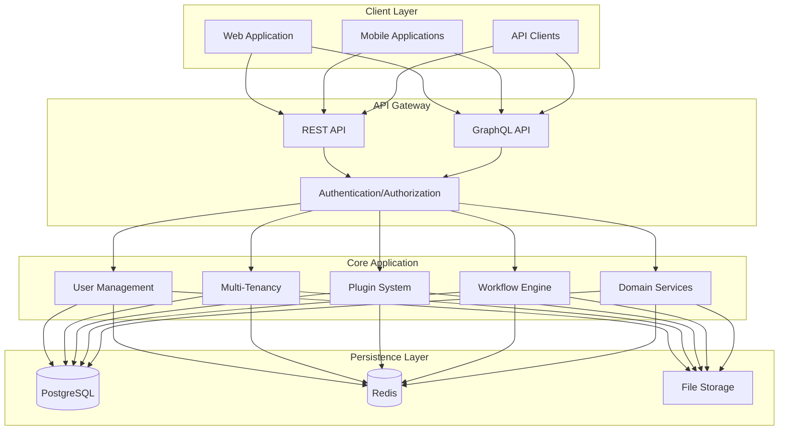
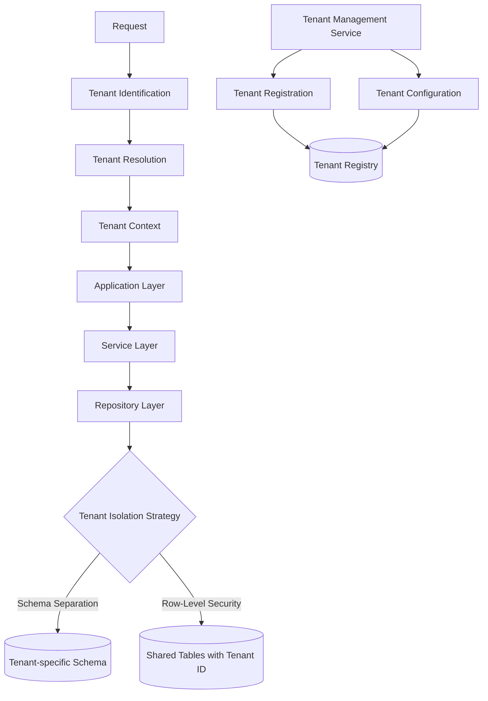
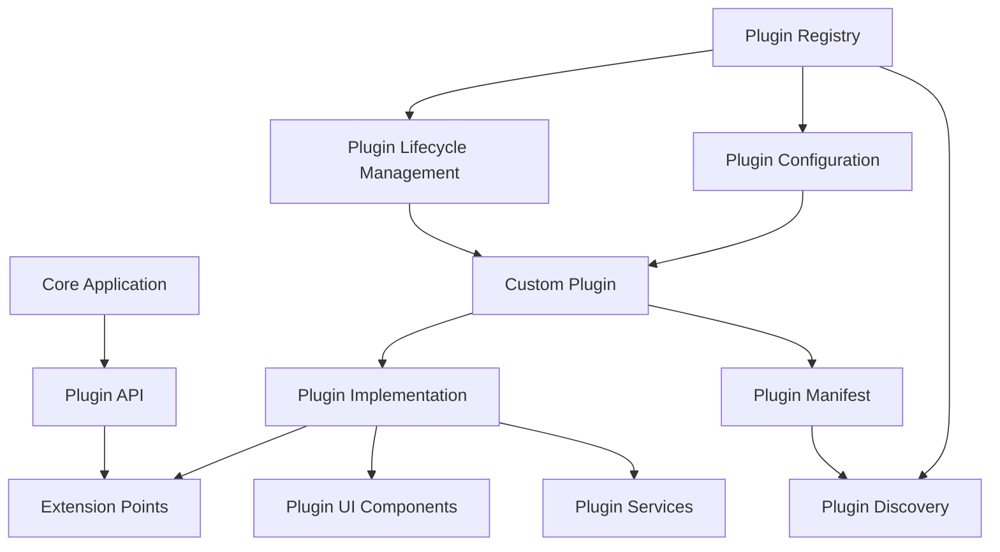
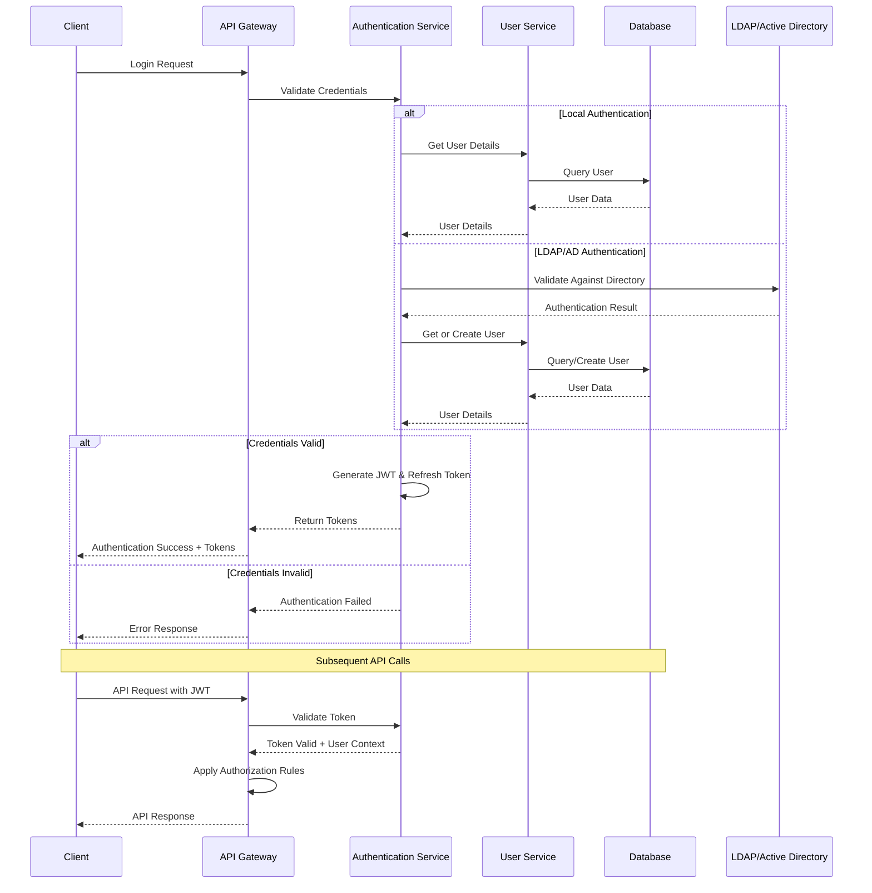

# Architecture for ACCI Nest Enterprise Application Framework

Status: Approved

## Technical Summary

ACCI Nest is a multi-tenant, plugin-extensible enterprise application framework built with NestJS (backend) and React (frontend). It employs a Domain-Driven Design approach with clear separation of concerns and a modular architecture. The system supports multi-tenancy at both the application and database levels, offering a flexible plugin architecture for extensibility, and implements comprehensive security measures following industry best practices.

This architecture document outlines the technical design decisions, infrastructure components, deployment strategies, and development patterns that will be used to implement the requirements specified in the PRD.

## Technology Table

| Technology | Description |
| ------------ | ------------------------------------------------------------- |
| NestJS | Progressive Node.js framework for building the backend |
| TypeScript | Strongly typed programming language for both backend and frontend |
| React | Frontend JavaScript library for building user interfaces |
| PostgreSQL | Primary relational database for persistent storage |
| Redis | In-memory data store for caching and pub/sub messaging |
| Docker | Containerization platform for consistent development and deployment |
| Docker Compose | Tool for defining and running multi-container applications |
| MikroORM | TypeScript ORM implementing Data Mapper and Unit of Work patterns, chosen for strong DDD support |
| Jest | Testing framework for unit and integration tests |
| Passport.js | Authentication middleware for Node.js |
| JWT | JSON Web Tokens for secure authentication |
| LDAP/Active Directory | Enterprise directory services integration for authentication |
| GraphQL | Query language for APIs alongside REST |
| Swagger/OpenAPI | API documentation and testing |
| Bun | JavaScript runtime and package manager for improved performance |
| Biome | Toolchain for code formatting and linting, replacing ESLint/Prettier |

## Architectural Diagrams

### High-Level System Architecture



### Multi-Tenancy Architecture



### Plugin System Architecture



### Authentication Flow



## Data Models, API Specs, Schemas, etc

### Core User Entity Schema

```typescript
interface User {
  id: string;
  email: string;
  password: string; // Hashed
  profile: {
    firstName: string;
    lastName: string;
    preferredLanguage: string;
  };
  tenantId: string;
  roles: Role[];
  authFactors: AuthFactor[];
  created: Date;
  updated: Date;
  lastLogin: Date;
  status: UserStatus; // 'active' | 'inactive' | 'locked' | 'pending'
}

interface Role {
  id: string;
  name: string;
  description: string;
  permissions: Permission[];
  tenantId: string;
  isSystem: boolean;
}

interface Permission {
  id: string;
  resource: string;
  action: string; // 'create' | 'read' | 'update' | 'delete'
  conditions?: any;
}

enum UserStatus {
  ACTIVE = 'active',
  INACTIVE = 'inactive',
  LOCKED = 'locked',
  PENDING = 'pending'
}
```

### Tenant Entity Schema

```typescript
interface Tenant {
  id: string;
  name: string;
  domain: string;
  status: TenantStatus;
  plan: string;
  features: Feature[];
  configuration: {
    theme: ThemeConfig;
    security: SecurityConfig;
    integrations: IntegrationConfig[];
  };
  created: Date;
  updated: Date;
}

enum TenantStatus {
  ACTIVE = 'active',
  SUSPENDED = 'suspended',
  TRIAL = 'trial',
  ARCHIVED = 'archived'
}

interface Feature {
  id: string;
  name: string;
  enabled: boolean;
  config?: any;
}
```

### Plugin Entity Schema

```typescript
interface Plugin {
  id: string;
  name: string;
  version: string;
  description: string;
  entry: string;
  dependencies: {
    [pluginId: string]: string; // version
  };
  permissions: Permission[];
  config: any;
  enabled: boolean;
  installDate: Date;
  updateDate: Date;
}
```

### Authentication API Endpoints

```typescript
/**
 * @route POST /auth/login
 * @group Authentication - Operations about user authentication
 * @param {string} email.body.required - User's email
 * @param {string} password.body.required - User's password
 * @param {string} tenantId.body.required - Tenant identifier
 * @returns {object} 200 - Access and refresh tokens
 * @returns {Error} 401 - Invalid credentials
 */

/**
 * @route POST /auth/login/ldap
 * @group Authentication - Operations about LDAP/AD authentication
 * @param {string} username.body.required - LDAP username
 * @param {string} password.body.required - LDAP password
 * @param {string} tenantId.body.required - Tenant identifier
 * @returns {object} 200 - Access and refresh tokens
 * @returns {Error} 401 - Invalid credentials
 */

/**
 * @route POST /auth/refresh
 * @group Authentication - Operations about user authentication
 * @param {string} token.body.required - Refresh token
 * @returns {object} 200 - New access token
 * @returns {Error} 401 - Invalid or expired refresh token
 */

/**
 * @route POST /auth/logout
 * @group Authentication - Operations about user authentication
 * @param {string} token.header.required - JWT token
 * @returns {object} 200 - Successfully logged out
 */

/**
 * @route POST /auth/mfa/enable
 * @group Authentication - Operations about user authentication
 * @param {string} token.header.required - JWT token
 * @param {string} type.body.required - MFA type (e.g., 'totp', 'sms')
 * @returns {object} 200 - MFA setup information
 */
```

## Project Structure

```
acci-nest/
├── docs/                    # Documentation files
│   ├── architecture/        # Architecture documents
│   │   ├── api/                 # API documentation
│   │   └── guides/              # Usage guides
│   ├── src/
│   │   ├── backend/             # NestJS backend application
│   │   │   ├── src/
│   │   │   │   ├── main.ts                # Application entry point
│   │   │   │   ├── app.module.ts          # Root application module
│   │   │   │   ├── config/                # Configuration and environment setup
│   │   │   │   ├── common/                # Shared utilities, decorators, and filters
│   │   │   │   ├── auth/                  # Authentication and authorization
│   │   │   │   │   ├── strategies/        # Authentication strategies (local, LDAP, OAuth)
│   │   │   │   │   ├── guards/            # Auth guards
│   │   │   │   │   └── services/          # Auth services
│   │   │   │   ├── users/                 # User management
│   │   │   │   ├── tenants/               # Multi-tenancy implementation
│   │   │   │   └── plugins/               # Plugin system
│   │   │   └── test/                     # Backend tests
│   │   ├── frontend/            # React frontend application
│   │   │   ├── src/
│   │   │   │   ├── index.tsx             # Entry point
│   │   │   │   ├── App.tsx               # Root component
│   │   │   │   ├── components/           # Reusable UI components
│   │   │   │   ├── pages/                # Page components
│   │   │   │   ├── hooks/                # Custom React hooks
│   │   │   │   ├── store/                # State management
│   │   │   │   ├── api/                  # API clients
│   │   │   │   └── utils/                # Utility functions
│   │   │   └── test/                    # Frontend tests
│   │   └── shared/               # Shared code between frontend and backend
│   │       ├── types/                   # TypeScript interfaces and types
│   │       ├── constants/               # Shared constants
│   │       └── utils/                   # Shared utility functions
│   ├── tests/                   # Test files
│   │   ├── unit/                # Unit tests
│   │   ├── integration/         # Integration tests
│   │   └── e2e/                 # End-to-end tests
│   ├── deploy/                  # Deployment configurations
│   │   ├── docker-compose/      # Docker Compose files
│   │   └── scripts/             # Deployment scripts
│   ├── .env.example             # Example environment variables
│   ├── docker-compose.yml       # Docker Compose configuration
│   └── package.json             # Project configuration
│   └── README.md                # Project documentation
```

## Infrastructure

The infrastructure is designed to be simple yet scalable, focusing on containerization for consistency across environments and easy deployment.

### Development Environment

- **Docker Compose**: Used for local development to emulate the production environment
- **Local Services**: PostgreSQL, Redis, and other required services running in containers
- **Hot Reloading**: Support for fast development cycles with automatic rebuilding

### Testing Environment

- **Isolated Containers**: Each test run uses isolated containers for dependencies
- **Test Database**: Separate PostgreSQL instance with migrations applied before tests
- **CI Integration**: Automated test runs on pull requests and before deployment

### Production Environment

- **Docker Compose**: Simplified deployment using Docker Compose
- **Database Management**: PostgreSQL with proper backup strategies
- **Caching Layer**: Redis for caching and session management
- **Reverse Proxy**: Nginx for handling inbound traffic and SSL termination
- **Storage**: Volume mounts for persistent data

### Scaling Strategy

- **Horizontal Scaling**: Add more container instances as load increases
- **Database Scaling**: Consider read replicas for heavy read loads
- **Caching Strategy**: Implement Redis clustering for cache scaling
- **Load Balancing**: Distribute traffic across multiple instances

## Testing Strategy

The project follows a testing pyramid approach to ensure code quality and system reliability.

### 1. Unit Tests (Base of the Pyramid)

- **Focus**: Testing individual classes, functions, or components in isolation (e.g., services, utility functions, individual React components). Dependencies are mocked.
- **Tools**: `Jest` serves as the primary testing framework, assertion library, and mocking tool (`jest.fn()`, `jest.spyOn()`, `jest.mock()`).
- **Goal**: Provide fast feedback on the correctness of isolated logic units. Aims for high code coverage.
- **When to Use Mocks**: In unit tests, dependencies should be mocked to isolate the unit being tested and ensure tests are fast and deterministic.

### 2. Integration Tests (Middle Layer)

- **Focus**: Verifying the interaction between multiple components within a module or across modules (e.g., Controller -> Service -> Repository -> Database).
- **Tools**:
  - `Jest` combined with NestJS's `@nestjs/testing` utilities for setting up testing modules
  - `@testcontainers/testcontainers` for managing real infrastructure dependencies (PostgreSQL, Redis, etc.)
  - For frontend, Testing Library (`@testing-library/react`) can be used for component interaction tests.
- **Real Dependencies vs. Mocks**:
  - **Use Testcontainers For**: Infrastructure dependencies that are part of our core system (PostgreSQL, Redis)
  - **Use Mocks For**: External third-party APIs, services outside our control, or dependencies that are impractical to containerize
- **Implementation Approach**:
  - Each integration test suite starts fresh containers with randomized ports
  - Containers are automatically stopped after tests complete
  - Database migrations are applied to the test database before tests run
  - Each test runs in isolation with proper setup/teardown
- **Goal**: Ensure that integrated components work together as expected. Provides higher confidence in the system's behavior with real dependencies while maintaining reasonable execution speed.

### 3. End-to-End (E2E) Tests (Top of the Pyramid)

- **Focus**: Testing the application as a whole from an external perspective, typically via its API endpoints or UI. Simulates real user scenarios and workflows.
- **Tools**:
  - `Jest` with `supertest` for backend API testing
  - Testcontainers for managing the application's infrastructure dependencies
  - For frontend E2E tests, frameworks like Cypress or Playwright can be considered
- **Real Environment**: E2E tests run against a complete application stack with real databases and services, configured specifically for testing.
- **Goal**: Validate complete features and user flows through the entire stack. Fewer tests due to higher execution time and maintenance cost.

### Testcontainers Implementation

For infrastructure dependencies, we use Testcontainers to ensure tests run against real, isolated instances:

#### PostgreSQL Integration Testing

```typescript
// Example of a repository integration test with Testcontainers
import { PostgreSqlContainer } from '@testcontainers/postgresql';
import { StartedPostgreSqlContainer } from '@testcontainers/postgresql/build/postgresql-container';
import { MikroORM } from '@mikro-orm/core';
import { UserRepository } from './user.repository';
import { User } from './entities/user.entity';

describe('UserRepository Integration Tests', () => {
  let pgContainer: StartedPostgreSqlContainer;
  let orm: MikroORM;
  let repository: UserRepository;

  beforeAll(async () => {
    // Start a PostgreSQL container
    pgContainer = await new PostgreSqlContainer()
      .withDatabase('test_db')
      .withUsername('test_user')
      .withPassword('test_password')
      .start();
    
    // Configure MikroORM to use the container
    orm = await MikroORM.init({
      type: 'postgresql',
      host: pgContainer.getHost(),
      port: pgContainer.getPort(),
      user: pgContainer.getUsername(),
      password: pgContainer.getPassword(),
      dbName: pgContainer.getDatabase(),
      entities: [User],
      // Apply migrations or schema
      migrations: { path: './migrations', transactional: true },
    });
    
    // Clear database and run migrations
    await orm.getSchemaGenerator().refreshDatabase();
    
    // Create repository instance
    repository = orm.em.getRepository(User);
  });

  afterAll(async () => {
    // Clean up resources
    await orm.close();
    await pgContainer.stop();
  });

  it('should create a new user', async () => {
    // Test implementation using real PostgreSQL database
    const user = new User();
    user.email = 'test@example.com';
    user.password = 'hashed_password';
    
    await repository.persistAndFlush(user);
    
    const foundUser = await repository.findOne({ email: 'test@example.com' });
    expect(foundUser).toBeDefined();
    expect(foundUser?.email).toBe('test@example.com');
  });
});
```

#### Redis Integration Testing

Redis is used extensively for caching and session management in our application. Testing these features with real Redis instances ensures proper behavior:

```typescript
import { RedisContainer } from '@testcontainers/redis';
import { StartedRedisContainer } from '@testcontainers/redis/build/redis-container';
import { CacheService } from './cache.service';
import { createClient } from 'redis';

describe('CacheService Integration Tests', () => {
  let redisContainer: StartedRedisContainer;
  let cacheService: CacheService;
  let redisClient: ReturnType<typeof createClient>;

  beforeAll(async () => {
    // Start a Redis container
    redisContainer = await new RedisContainer()
      .withExposedPorts(6379)
      .start();
    
    // Create Redis client connected to the container
    redisClient = createClient({
      url: `redis://${redisContainer.getHost()}:${redisContainer.getMappedPort(6379)}`
    });
    
    await redisClient.connect();
    
    // Create cache service instance with the test client
    cacheService = new CacheService(redisClient);
  });

  afterAll(async () => {
    // Clean up resources
    await redisClient.disconnect();
    await redisContainer.stop();
  });

  beforeEach(async () => {
    // Clear Redis database before each test
    await redisClient.flushAll();
  });

  it('should store and retrieve cached data', async () => {
    const key = 'test:key';
    const value = { id: 1, name: 'Test Value' };
    
    await cacheService.set(key, value, 60); // Cache for 60 seconds
    const cachedValue = await cacheService.get(key);
    
    expect(cachedValue).toEqual(value);
  });

  it('should handle cache expiration correctly', async () => {
    const key = 'test:expiring';
    const value = { id: 2, name: 'Expiring Value' };
    
    // Cache for 1 second
    await cacheService.set(key, value, 1);
    
    // Wait for expiration
    await new Promise(resolve => setTimeout(resolve, 1100));
    
    const cachedValue = await cacheService.get(key);
    expect(cachedValue).toBeNull();
  });
});

#### Multi-Tenancy Integration Testing

Testing multi-tenancy features requires validating proper tenant isolation at both the application and database levels. Testcontainers can help us create realistic test environments for multi-tenant testing:

```typescript
import { PostgreSqlContainer } from '@testcontainers/postgresql';
import { StartedPostgreSqlContainer } from '@testcontainers/postgresql/build/postgresql-container';
import { MikroORM } from '@mikro-orm/core';
import { TenantContext } from './tenant-context';
import { TenantAwareRepository } from './tenant-aware.repository';
import { User } from './entities/user.entity';
import { Tenant } from './entities/tenant.entity';

describe('Multi-Tenancy Integration Tests', () => {
  let pgContainer: StartedPostgreSqlContainer;
  let orm: MikroORM;
  let tenantContext: TenantContext;
  let userRepository: TenantAwareRepository<User>;
  
  // Test tenants
  const TENANT_A = { id: 'tenant-a', name: 'Tenant A' };
  const TENANT_B = { id: 'tenant-b', name: 'Tenant B' };

  beforeAll(async () => {
    // Start a PostgreSQL container
    pgContainer = await new PostgreSqlContainer()
      .withDatabase('multi_tenant_test')
      .withUsername('test_user')
      .withPassword('test_password')
      .start();
    
    // Configure MikroORM
    orm = await MikroORM.init({
      type: 'postgresql',
      host: pgContainer.getHost(),
      port: pgContainer.getPort(),
      user: pgContainer.getUsername(),
      password: pgContainer.getPassword(),
      dbName: pgContainer.getDatabase(),
      entities: [User, Tenant],
      migrations: { path: './migrations', transactional: true },
    });
    
    // Create schema and initialize database
    await orm.getSchemaGenerator().refreshDatabase();
    
    // Set up test tenants
    const tenantRepo = orm.em.getRepository(Tenant);
    const tenantA = tenantRepo.create(TENANT_A);
    const tenantB = tenantRepo.create(TENANT_B);
    await tenantRepo.persistAndFlush([tenantA, tenantB]);
    
    // Create tenant context and repository for testing
    tenantContext = new TenantContext();
    userRepository = new TenantAwareRepository<User>(orm.em, User, tenantContext);
  });

  afterAll(async () => {
    await orm.close();
    await pgContainer.stop();
  });

  beforeEach(async () => {
    // Clear user data between tests
    await orm.em.nativeDelete(User, {});
    orm.em.clear();
  });

  it('should isolate data between tenants', async () => {
    // Set tenant context to Tenant A
    tenantContext.setCurrentTenant(TENANT_A.id);
    
    // Create user for Tenant A
    const userA = new User();
    userA.email = 'user@tenantA.com';
    userA.name = 'User A';
    await userRepository.persistAndFlush(userA);
    
    // Switch to Tenant B
    tenantContext.setCurrentTenant(TENANT_B.id);
    
    // Create user for Tenant B
    const userB = new User();
    userB.email = 'user@tenantB.com';
    userB.name = 'User B';
    await userRepository.persistAndFlush(userB);
    
    // Tenant B should only see its own user
    const tenantBUsers = await userRepository.findAll();
    expect(tenantBUsers).toHaveLength(1);
    expect(tenantBUsers[0].email).toBe('user@tenantB.com');
    
    // Switch back to Tenant A
    tenantContext.setCurrentTenant(TENANT_A.id);
    
    // Tenant A should only see its own user
    const tenantAUsers = await userRepository.findAll();
    expect(tenantAUsers).toHaveLength(1);
    expect(tenantAUsers[0].email).toBe('user@tenantA.com');
  });

  it('should enforce tenant isolation when querying by ID', async () => {
    // Create users for both tenants
    tenantContext.setCurrentTenant(TENANT_A.id);
    const userA = new User();
    userA.email = 'user@tenantA.com';
    await userRepository.persistAndFlush(userA);
    const userAId = userA.id;
    
    tenantContext.setCurrentTenant(TENANT_B.id);
    const userB = new User();
    userB.email = 'user@tenantB.com';
    await userRepository.persistAndFlush(userB);
    
    // Tenant B should not be able to access Tenant A's user by ID
    const result = await userRepository.findOne({ id: userAId });
    expect(result).toBeNull();
  });
});

### Testing External Integrations

For external APIs and third-party services:

- **Preferred Approach**: Mock these dependencies in most tests for reliability and speed
- **Alternative Approaches**:
  - Use official sandbox/test environments if provided by the service
  - Consider contract testing with tools like Pact.js for API integration verification
  - Maintain a small set of tests against real external services, but separate them from the main test suite and run them less frequently

## Deployment Plan

### Initial Setup

1. **Environment Configuration**:
   - Set up domain and DNS records
   - Configure SSL certificates
   - Prepare environment variables

2. **Database Initialization**:
   - Create initial database schema
   - Run base migrations
   - Set up database backup strategy

3. **Application Deployment**:
   - Deploy Docker Compose stack
   - Verify application health checks
   - Configure logging and monitoring

### Deployment Process

1. **Build Process**:
   - Build Docker images for backend and frontend
   - Tag images with version and build information
   - Run automated tests against built images

2. **Deployment Steps**:
   - Pull latest images to the target environment
   - Run database migrations
   - Update Docker Compose configuration
   - Restart services with zero downtime

3. **Verification**:
   - Run health checks on deployed services
   - Verify database connectivity
   - Check authentication flows
   - Validate API functionality

### Rollback Strategy

1. **Automatic Failure Detection**:
   - Monitor health checks post-deployment
   - Set thresholds for error rates and response times

2. **Rollback Procedure**:
   - Revert to previous Docker Compose configuration
   - Restore database to pre-migration state if needed
   - Update DNS/load balancer to previous version

## Change Log

| Change | Date | Description |
| -------------------- | ---------- | ------------------------------------------------------------- |
| Initial draft | 2025-03-30 | Initial draft of the architecture document |
| Add Testing Strategy | 2025-03-31 | Added detailed Testing Strategy section. |
| Finalize ORM Choice | 2025-03-31 | Selected MikroORM as the project ORM for its strong DDD support. |
| Add Biome Tooling | 2025-03-31 | Specified Biome for linting and formatting, replacing ESLint/Prettier. |
| Add LDAP/AD Integration | 2025-04-01 | Added LDAP/Active Directory integration details to authentication flow and API endpoints. |

#### Combined Infrastructure Testing (PostgreSQL + Redis)

In real-world scenarios, services often interact with multiple infrastructure components simultaneously. Here's how to test a service that uses both PostgreSQL for persistence and Redis for caching:

```typescript
import { PostgreSqlContainer } from '@testcontainers/postgresql';
import { RedisContainer } from '@testcontainers/redis';
import { MikroORM } from '@mikro-orm/core';
import { UserService } from './user.service';
import { UserRepository } from './user.repository';
import { CacheService } from './cache.service';
import { User } from './entities/user.entity';
import { createClient } from 'redis';

describe('UserService Integration Tests', () => {
  // Container instances
  let pgContainer: StartedPostgreSqlContainer;
  let redisContainer: StartedRedisContainer;
  
  // Service dependencies
  let orm: MikroORM;
  let redisClient: ReturnType<typeof createClient>;
  let userRepository: UserRepository;
  let cacheService: CacheService;
  
  // Service under test
  let userService: UserService;

  beforeAll(async () => {
    // Start containers in parallel for efficiency
    [pgContainer, redisContainer] = await Promise.all([
      new PostgreSqlContainer().withDatabase('test_db').start(),
      new RedisContainer().start()
    ]);
    
    // Set up database connection
    orm = await MikroORM.init({
      type: 'postgresql',
      host: pgContainer.getHost(),
      port: pgContainer.getPort(),
      user: pgContainer.getUsername(),
      password: pgContainer.getPassword(),
      dbName: pgContainer.getDatabase(),
      entities: [User],
      migrations: { path: './migrations', transactional: true },
    });
    
    // Set up Redis client
    redisClient = createClient({
      url: `redis://${redisContainer.getHost()}:${redisContainer.getMappedPort(6379)}`
    });
    await redisClient.connect();
    
    // Initialize services
    userRepository = orm.em.getRepository(User);
    cacheService = new CacheService(redisClient);
    userService = new UserService(userRepository, cacheService);
    
    // Prepare database
    await orm.getSchemaGenerator().refreshDatabase();
  });

  afterAll(async () => {
    // Clean up all resources
    await redisClient.disconnect();
    await orm.close();
    await Promise.all([
      pgContainer.stop(),
      redisContainer.stop()
    ]);
  });

  beforeEach(async () => {
    // Clear data between tests
    await redisClient.flushAll();
    await orm.em.nativeDelete(User, {});
    orm.em.clear();
  });

  it('should cache user after retrieval from database', async () => {
    // Create test user in database
    const user = new User();
    user.email = 'cached@example.com';
    user.name = 'Cached User';
    await userRepository.persistAndFlush(user);
    
    // First call should retrieve from database and cache
    const firstCall = await userService.findByEmail('cached@example.com');
    expect(firstCall).toBeDefined();
    expect(firstCall.email).toBe('cached@example.com');
    
    // Verify it was cached in Redis
    const cachedValue = await redisClient.get(`user:email:cached@example.com`);
    expect(cachedValue).not.toBeNull();
    
    // Second call should use cache
    // We can verify by spying on the repository method
    const findOneSpy = jest.spyOn(userRepository, 'findOne');
    
    const secondCall = await userService.findByEmail('cached@example.com');
    expect(secondCall).toBeDefined();
    expect(secondCall.email).toBe('cached@example.com');
    
    // Repository should not be called on second request
    expect(findOneSpy).not.toHaveBeenCalled();
  });

  it('should invalidate cache when user is updated', async () => {
    // Create and cache a user
    const user = new User();
    user.email = 'update@example.com';
    user.name = 'Original Name';
    await userRepository.persistAndFlush(user);
    
    // First call to cache
    await userService.findByEmail('update@example.com');
    
    // Update the user
    user.name = 'Updated Name';
    await userService.updateUser(user);
    
    // Verify cache was invalidated
    const cachedValue = await redisClient.get(`user:email:update@example.com`);
    expect(cachedValue).toBeNull();
    
    // Retrieve again to test database fetch
    const updatedUser = await userService.findByEmail('update@example.com');
    expect(updatedUser.name).toBe('Updated Name');
  });
});

#### Authentication Services Testing (LDAP)

For testing authentication services, especially those that integrate with directory services like LDAP, we can use the LDAP Testcontainer:

```typescript
import { GenericContainer } from '@testcontainers/core';
import { AuthService } from './auth.service';
import { LdapService } from './ldap.service';
import { UserRepository } from './user.repository';
import { User } from './entities/user.entity';

describe('LDAP Authentication Integration Tests', () => {
  let ldapContainer;
  let ldapService: LdapService;
  let userRepository: UserRepository;
  let authService: AuthService;

  beforeAll(async () => {
    // Start OpenLDAP container
    ldapContainer = await new GenericContainer('osixia/openldap:1.5.0')
      .withExposedPorts(389, 636)
      .withEnvironment({
        LDAP_ORGANISATION: 'Test Org',
        LDAP_DOMAIN: 'test.local',
        LDAP_ADMIN_PASSWORD: 'admin',
        LDAP_CONFIG_PASSWORD: 'config',
        LDAP_READONLY_USER: 'true',
        LDAP_READONLY_USER_USERNAME: 'readonly',
        LDAP_READONLY_USER_PASSWORD: 'readonly'
      })
      .start();
    
    // Initialize services with container connection details
    ldapService = new LdapService({
      url: `ldap://${ldapContainer.getHost()}:${ldapContainer.getMappedPort(389)}`,
      bindDN: 'cn=admin,dc=test,dc=local',
      bindCredentials: 'admin',
      searchBase: 'dc=test,dc=local',
      searchFilter: '(uid={{username}})'
    });
    
    // Mock user repository for this test
    userRepository = {
      findOne: jest.fn(),
      create: jest.fn(),
      persistAndFlush: jest.fn()
    } as unknown as UserRepository;
    
    // Initialize auth service with LDAP integration
    authService = new AuthService(userRepository, ldapService);
    
    // Populate LDAP with test users
    await addTestUsersToLdap(ldapContainer);
  });

  afterAll(async () => {
    await ldapContainer.stop();
  });

  it('should authenticate valid LDAP user', async () => {
    // Setup user repository mock
    userRepository.findOne.mockResolvedValue(null); // User doesn't exist yet
    userRepository.create.mockImplementation((data) => {
      return { id: 'new-id', ...data } as User;
    });
    
    // Test authentication
    const result = await authService.authenticateLdap({
      username: 'jdoe',
      password: 'test123',
      tenantId: 'tenant1'
    });
    
    // Verify success
    expect(result.success).toBe(true);
    expect(result.user).toBeDefined();
    expect(result.user.email).toBe('jdoe@test.local');
    
    // Verify user was created
    expect(userRepository.create).toHaveBeenCalledWith(expect.objectContaining({
      email: 'jdoe@test.local',
      firstName: 'John',
      lastName: 'Doe',
      tenantId: 'tenant1',
      source: 'ldap'
    }));
  });

  it('should reject invalid LDAP credentials', async () => {
    const result = await authService.authenticateLdap({
      username: 'jdoe',
      password: 'wrongpassword',
      tenantId: 'tenant1'
    });
    
    expect(result.success).toBe(false);
    expect(result.error).toBe('Invalid credentials');
  });
  
  // Helper function to add test users to LDAP
  async function addTestUsersToLdap(container) {
    // Use ldapadd to populate test data
    const ldifContent = `
dn: ou=users,dc=test,dc=local
objectClass: organizationalUnit
ou: users

dn: uid=jdoe,ou=users,dc=test,dc=local
objectClass: inetOrgPerson
uid: jdoe
cn: John Doe
sn: Doe
givenName: John
mail: jdoe@test.local
userPassword: test123
    `;
    
    await container.exec(['ldapadd', '-x', '-D', 'cn=admin,dc=test,dc=local', '-w', 'admin', '-f', '/tmp/test-users.ldif']);
  }
});

#### Plugin System Testing

For testing our plugin system, we need to verify that plugins can be dynamically loaded, configured, and executed in isolation:

```typescript
import { PostgreSqlContainer } from '@testcontainers/postgresql';
import { MikroORM } from '@mikro-orm/core';
import { PluginManager } from './plugin.manager';
import { PluginRegistry } from './plugin.registry';
import { PluginLoader } from './plugin.loader';
import { Plugin } from './entities/plugin.entity';
import * as fs from 'fs';
import * as path from 'path';

describe('Plugin System Integration Tests', () => {
  let pgContainer;
  let orm: MikroORM;
  let pluginManager: PluginManager;
  let pluginRegistry: PluginRegistry;
  let pluginLoader: PluginLoader;
  
  // Test plugin paths
  const testPluginsDir = path.join(__dirname, '../test-plugins');
  const samplePluginPath = path.join(testPluginsDir, 'sample-plugin');
  
  beforeAll(async () => {
    // Ensure test plugins directory exists
    if (!fs.existsSync(testPluginsDir)) {
      fs.mkdirSync(testPluginsDir, { recursive: true });
    }
    
    // Create sample plugin for testing
    await createSamplePlugin(samplePluginPath);
    
    // Start PostgreSQL container
    pgContainer = await new PostgreSqlContainer()
      .withDatabase('plugin_test_db')
      .start();
    
    // Initialize ORM
    orm = await MikroORM.init({
      type: 'postgresql',
      host: pgContainer.getHost(),
      port: pgContainer.getPort(),
      user: pgContainer.getUsername(),
      password: pgContainer.getPassword(),
      dbName: pgContainer.getDatabase(),
      entities: [Plugin],
      migrations: { path: './migrations', transactional: true },
    });
    
    // Prepare database
    await orm.getSchemaGenerator().refreshDatabase();
    
    // Set up plugin system components
    pluginRegistry = new PluginRegistry(orm.em.getRepository(Plugin));
    pluginLoader = new PluginLoader(testPluginsDir);
    pluginManager = new PluginManager(pluginRegistry, pluginLoader);
  });

  afterAll(async () => {
    await orm.close();
    await pgContainer.stop();
    
    // Clean up test plugins
    if (fs.existsSync(testPluginsDir)) {
      fs.rmSync(testPluginsDir, { recursive: true, force: true });
    }
  });

  beforeEach(async () => {
    // Clear plugin registry between tests
    await orm.em.nativeDelete(Plugin, {});
    orm.em.clear();
  });

  it('should discover and load a plugin', async () => {
    // Discover available plugins
    const discoveredPlugins = await pluginManager.discoverPlugins();
    
    expect(discoveredPlugins).toHaveLength(1);
    expect(discoveredPlugins[0].name).toBe('sample-plugin');
    
    // Register the plugin
    await pluginManager.registerPlugin(discoveredPlugins[0]);
    
    // Verify plugin was registered
    const registeredPlugins = await pluginRegistry.listPlugins();
    expect(registeredPlugins).toHaveLength(1);
    expect(registeredPlugins[0].name).toBe('sample-plugin');
    
    // Load and initialize plugin
    const loadedPlugin = await pluginManager.loadPlugin(registeredPlugins[0].id);
    expect(loadedPlugin).toBeDefined();
    expect(loadedPlugin.name).toBe('sample-plugin');
    
    // Test plugin functionality
    const result = await loadedPlugin.instance.performAction('test');
    expect(result).toBe('sample-plugin processed: test');
  });

  it('should handle plugin configuration', async () => {
    // Register plugin with configuration
    const [plugin] = await pluginManager.discoverPlugins();
    
    plugin.config = {
      mode: 'advanced',
      options: {
        prefix: 'custom-',
      }
    };
    
    await pluginManager.registerPlugin(plugin);
    
    // Load plugin with configuration
    const pluginId = (await pluginRegistry.listPlugins())[0].id;
    const loadedPlugin = await pluginManager.loadPlugin(pluginId);
    
    // Test configured behavior
    const result = await loadedPlugin.instance.performAction('config-test');
    expect(result).toBe('sample-plugin processed with custom-prefix: config-test');
  });
  
  // Helper to create a test plugin
  async function createSamplePlugin(pluginPath) {
    if (!fs.existsSync(pluginPath)) {
      fs.mkdirSync(pluginPath, { recursive: true });
    }
    
    // Create plugin manifest
    const manifest = {
      name: 'sample-plugin',
      version: '1.0.0',
      description: 'A sample plugin for testing',
      entry: 'index.js',
      dependencies: {}
    };
    
    fs.writeFileSync(
      path.join(pluginPath, 'manifest.json'),
      JSON.stringify(manifest, null, 2)
    );
    
    // Create plugin implementation
    const implementation = `
      module.exports = class SamplePlugin {
        constructor(config = {}) {
          this.config = config;
          this.prefix = config.options?.prefix || '';
        }
        
        async performAction(input) {
          if (this.prefix) {
            return \`sample-plugin processed with \${this.prefix}prefix: \${input}\`;
          }
          return \`sample-plugin processed: \${input}\`;
        }
      };
    `;
    
    fs.writeFileSync(path.join(pluginPath, 'index.js'), implementation);
  }
});
