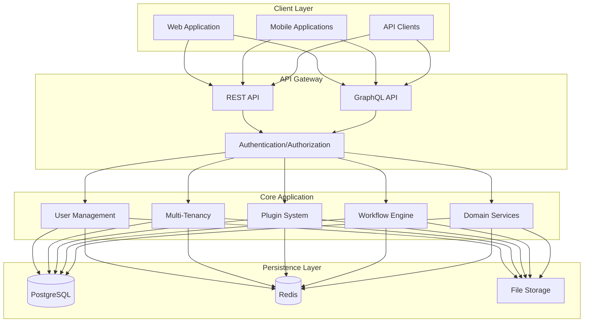
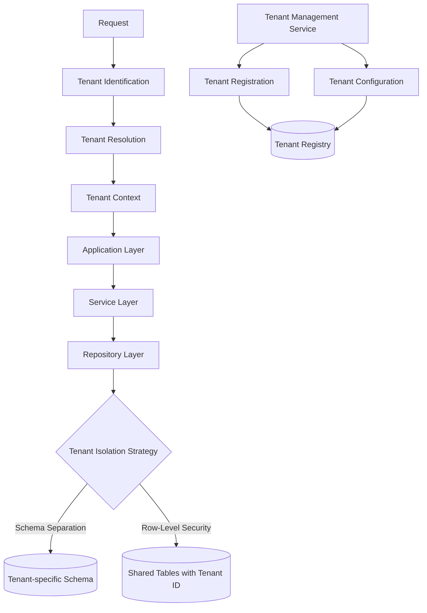
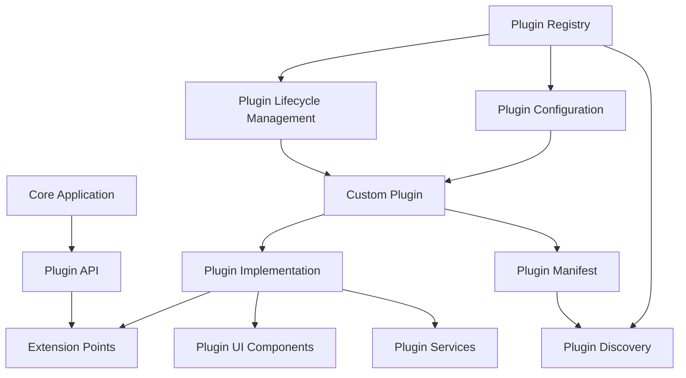
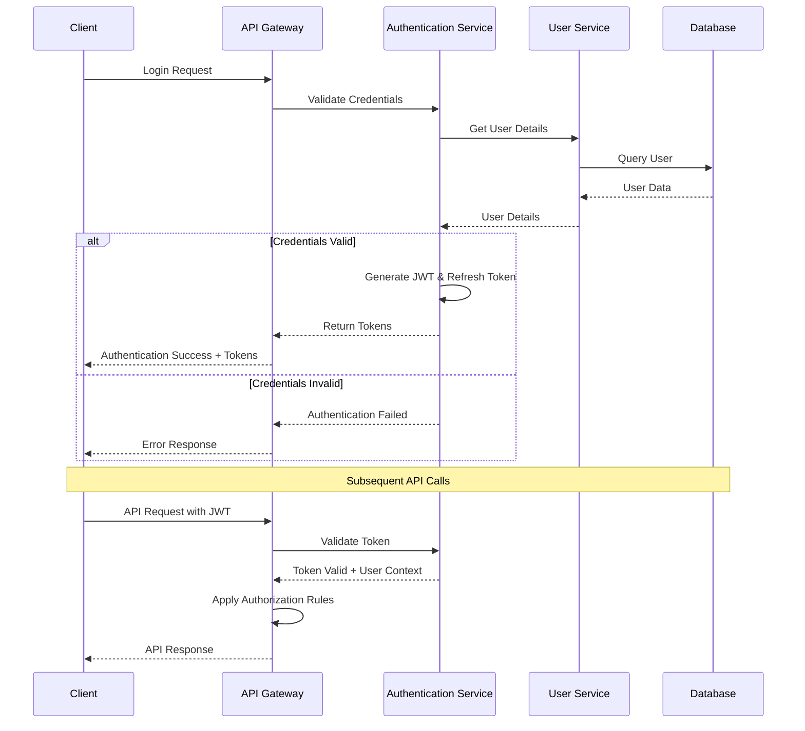

# Architecture for ACCI Nest Enterprise Application Framework

Status: Approved

## Technical Summary

ACCI Nest is a multi-tenant, plugin-extensible enterprise application framework built with NestJS (backend) and React (frontend). It employs a Domain-Driven Design approach with clear separation of concerns and a modular architecture. The system supports multi-tenancy at both the application and database levels, offering a flexible plugin architecture for extensibility, and implements comprehensive security measures following industry best practices.

This architecture document outlines the technical design decisions, infrastructure components, deployment strategies, and development patterns that will be used to implement the requirements specified in the PRD.

## Technology Table

| Technology | Description |
| ------------ | ------------------------------------------------------------- |
| NestJS | Progressive Node.js framework for building the backend |
| TypeScript | Strongly typed programming language for both backend and frontend |
| React | Frontend JavaScript library for building user interfaces |
| PostgreSQL | Primary relational database for persistent storage |
| Redis | In-memory data store for caching and pub/sub messaging |
| Docker | Containerization platform for consistent development and deployment |
| Docker Compose | Tool for defining and running multi-container applications |
| MikroORM | TypeScript ORM implementing Data Mapper and Unit of Work patterns, chosen for strong DDD support |
| Jest | Testing framework for unit and integration tests |
| Passport.js | Authentication middleware for Node.js |
| JWT | JSON Web Tokens for secure authentication |
| GraphQL | Query language for APIs alongside REST |
| Swagger/OpenAPI | API documentation and testing |
| Bun | JavaScript runtime and package manager for improved performance |

## Architectural Diagrams

### High-Level System Architecture



### Multi-Tenancy Architecture



### Plugin System Architecture



### Authentication Flow



## Data Models, API Specs, Schemas, etc

### Core User Entity Schema

```typescript
interface User {
  id: string;
  email: string;
  password: string; // Hashed
  profile: {
    firstName: string;
    lastName: string;
    preferredLanguage: string;
  };
  tenantId: string;
  roles: Role[];
  authFactors: AuthFactor[];
  created: Date;
  updated: Date;
  lastLogin: Date;
  status: UserStatus; // 'active' | 'inactive' | 'locked' | 'pending'
}

interface Role {
  id: string;
  name: string;
  description: string;
  permissions: Permission[];
  tenantId: string;
  isSystem: boolean;
}

interface Permission {
  id: string;
  resource: string;
  action: string; // 'create' | 'read' | 'update' | 'delete'
  conditions?: any;
}

enum UserStatus {
  ACTIVE = 'active',
  INACTIVE = 'inactive',
  LOCKED = 'locked',
  PENDING = 'pending'
}
```

### Tenant Entity Schema

```typescript
interface Tenant {
  id: string;
  name: string;
  domain: string;
  status: TenantStatus;
  plan: string;
  features: Feature[];
  configuration: {
    theme: ThemeConfig;
    security: SecurityConfig;
    integrations: IntegrationConfig[];
  };
  created: Date;
  updated: Date;
}

enum TenantStatus {
  ACTIVE = 'active',
  SUSPENDED = 'suspended',
  TRIAL = 'trial',
  ARCHIVED = 'archived'
}

interface Feature {
  id: string;
  name: string;
  enabled: boolean;
  config?: any;
}
```

### Plugin Entity Schema

```typescript
interface Plugin {
  id: string;
  name: string;
  version: string;
  description: string;
  entry: string;
  dependencies: {
    [pluginId: string]: string; // version
  };
  permissions: Permission[];
  config: any;
  enabled: boolean;
  installDate: Date;
  updateDate: Date;
}
```

### Authentication API Endpoints

```typescript
/**
 * @route POST /auth/login
 * @group Authentication - Operations about user authentication
 * @param {string} email.body.required - User's email
 * @param {string} password.body.required - User's password
 * @param {string} tenantId.body.required - Tenant identifier
 * @returns {object} 200 - Access and refresh tokens
 * @returns {Error} 401 - Invalid credentials
 */

/**
 * @route POST /auth/refresh
 * @group Authentication - Operations about user authentication
 * @param {string} token.body.required - Refresh token
 * @returns {object} 200 - New access token
 * @returns {Error} 401 - Invalid or expired refresh token
 */

/**
 * @route POST /auth/logout
 * @group Authentication - Operations about user authentication
 * @param {string} token.header.required - JWT token
 * @returns {object} 200 - Successfully logged out
 */

/**
 * @route POST /auth/mfa/enable
 * @group Authentication - Operations about user authentication
 * @param {string} token.header.required - JWT token
 * @param {string} type.body.required - MFA type (e.g., 'totp', 'sms')
 * @returns {object} 200 - MFA setup information
 */
```

## Project Structure

```
acci-nest/
├── docs/                    # Documentation files
│   ├── architecture/        # Architecture documents
│   │   ├── api/                 # API documentation
│   │   └── guides/              # Usage guides
│   ├── src/
│   │   ├── backend/             # NestJS backend application
│   │   │   ├── src/
│   │   │   │   ├── main.ts                # Application entry point
│   │   │   │   ├── app.module.ts          # Root application module
│   │   │   │   ├── config/                # Configuration and environment setup
│   │   │   │   ├── common/                # Shared utilities, decorators, and filters
│   │   │   │   ├── auth/                  # Authentication and authorization
│   │   │   │   ├── users/                 # User management
│   │   │   │   ├── tenants/               # Multi-tenancy implementation
│   │   │   │   └── plugins/               # Plugin system
│   │   │   └── test/                     # Backend tests
│   │   ├── frontend/            # React frontend application
│   │   │   ├── src/
│   │   │   │   ├── index.tsx             # Entry point
│   │   │   │   ├── App.tsx               # Root component
│   │   │   │   ├── components/           # Reusable UI components
│   │   │   │   ├── pages/                # Page components
│   │   │   │   ├── hooks/                # Custom React hooks
│   │   │   │   ├── store/                # State management
│   │   │   │   ├── api/                  # API clients
│   │   │   │   └── utils/                # Utility functions
│   │   │   └── test/                    # Frontend tests
│   │   └── shared/               # Shared code between frontend and backend
│   │       ├── types/                   # TypeScript interfaces and types
│   │       ├── constants/               # Shared constants
│   │       └── utils/                   # Shared utility functions
│   ├── tests/                   # Test files
│   │   ├── unit/                # Unit tests
│   │   ├── integration/         # Integration tests
│   │   └── e2e/                 # End-to-end tests
│   ├── deploy/                  # Deployment configurations
│   │   ├── docker-compose/      # Docker Compose files
│   │   └── scripts/             # Deployment scripts
│   ├── .env.example             # Example environment variables
│   ├── docker-compose.yml       # Docker Compose configuration
│   └── package.json             # Project configuration
│   └── README.md                # Project documentation
```

## Infrastructure

The infrastructure is designed to be simple yet scalable, focusing on containerization for consistency across environments and easy deployment.

### Development Environment

- **Docker Compose**: Used for local development to emulate the production environment
- **Local Services**: PostgreSQL, Redis, and other required services running in containers
- **Hot Reloading**: Support for fast development cycles with automatic rebuilding

### Testing Environment

- **Isolated Containers**: Each test run uses isolated containers for dependencies
- **Test Database**: Separate PostgreSQL instance with migrations applied before tests
- **CI Integration**: Automated test runs on pull requests and before deployment

### Production Environment

- **Docker Compose**: Simplified deployment using Docker Compose
- **Database Management**: PostgreSQL with proper backup strategies
- **Caching Layer**: Redis for caching and session management
- **Reverse Proxy**: Nginx for handling inbound traffic and SSL termination
- **Storage**: Volume mounts for persistent data

### Scaling Strategy

- **Horizontal Scaling**: Add more container instances as load increases
- **Database Scaling**: Consider read replicas for heavy read loads
- **Caching Strategy**: Implement Redis clustering for cache scaling
- **Load Balancing**: Distribute traffic across multiple instances

## Testing Strategy

The project follows a testing pyramid approach to ensure code quality and system reliability.

### 1. Unit Tests (Base of the Pyramid)

- **Focus**: Testing individual classes, functions, or components in isolation (e.g., services, utility functions, individual React components). Dependencies are mocked.
- **Tools**: `Jest` serves as the primary testing framework, assertion library, and mocking tool (`jest.fn()`, `jest.spyOn()`, `jest.mock()`).
- **Goal**: Provide fast feedback on the correctness of isolated logic units. Aims for high code coverage.

### 2. Integration Tests (Middle Layer)

- **Focus**: Verifying the interaction between multiple components within a module or across modules (e.g., Controller -> Service -> Repository Mock). External systems like databases or third-party APIs are typically mocked or stubbed.
- **Tools**: `Jest` combined with NestJS's `@nestjs/testing` utilities. The `Test.createTestingModule({...})` method is used to set up a testing module environment, allowing for controlled dependency injection and mocking. For frontend, Testing Library (`@testing-library/react`) can be used for component interaction tests.
- **Goal**: Ensure that integrated components work together as expected. Balances coverage and execution speed.

### 3. End-to-End (E2E) Tests (Top of the Pyramid)

- **Focus**: Testing the application as a whole from an external perspective, typically via its API endpoints or UI. Simulates real user scenarios and workflows.
- **Tools**: `Jest` with `supertest` for backend API testing. A separate, seeded test database might be used. For frontend E2E tests, frameworks like Cypress or Playwright can be considered.
- **Goal**: Validate complete features and user flows through the entire stack. Fewer tests due to higher execution time and maintenance cost.

## Deployment Plan

### Initial Setup

1. **Environment Configuration**:
   - Set up domain and DNS records
   - Configure SSL certificates
   - Prepare environment variables

2. **Database Initialization**:
   - Create initial database schema
   - Run base migrations
   - Set up database backup strategy

3. **Application Deployment**:
   - Deploy Docker Compose stack
   - Verify application health checks
   - Configure logging and monitoring

### Deployment Process

1. **Build Process**:
   - Build Docker images for backend and frontend
   - Tag images with version and build information
   - Run automated tests against built images

2. **Deployment Steps**:
   - Pull latest images to the target environment
   - Run database migrations
   - Update Docker Compose configuration
   - Restart services with zero downtime

3. **Verification**:
   - Run health checks on deployed services
   - Verify database connectivity
   - Check authentication flows
   - Validate API functionality

### Rollback Strategy

1. **Automatic Failure Detection**:
   - Monitor health checks post-deployment
   - Set thresholds for error rates and response times

2. **Rollback Procedure**:
   - Revert to previous Docker Compose configuration
   - Restore database to pre-migration state if needed
   - Update DNS/load balancer to previous version

## Change Log

| Change | Date | Description |
| -------------------- | ---------- | ------------------------------------------------------------- |
| Initial draft | 2025-03-30 | Initial draft of the architecture document |
| Add Testing Strategy | 2025-03-31 | Added detailed Testing Strategy section. |
| Finalize ORM Choice | 2025-03-31 | Selected MikroORM as the project ORM for its strong DDD support. |
