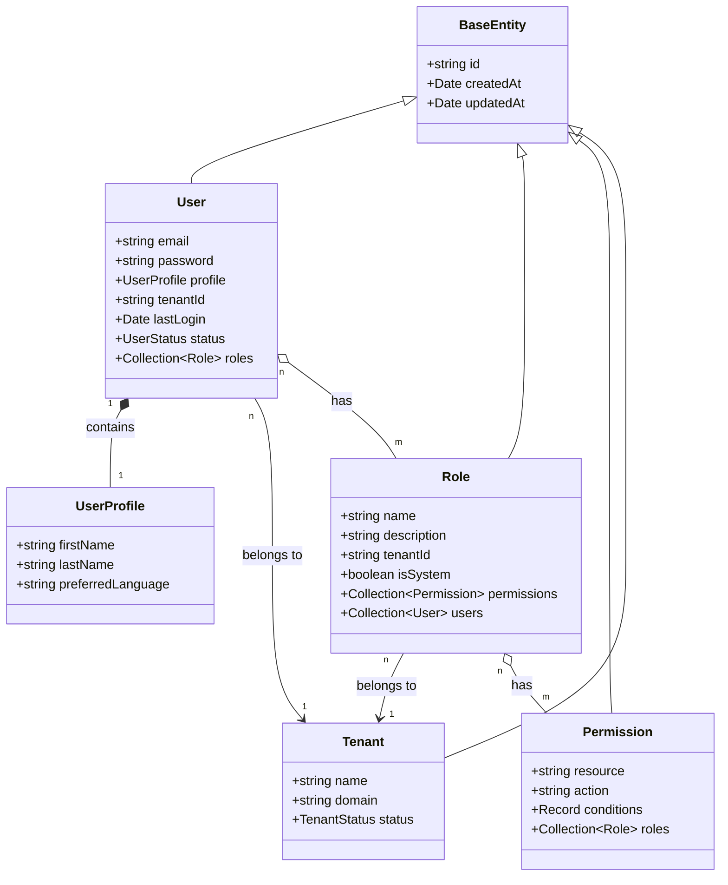

# Epic-2 - Story-6

User and Role Management - Core Entities

**As a** developer
**I want** to implement the core user and role management entities  
**So that** the system can manage users, roles and their permissions securely with multi-tenancy support.

## Status

Completed

## Context

- This is the first story for Epic-2 (User Management and Multi-Tenancy), following the completion of Epic-1 (Core Framework Setup).
- It builds upon the database infrastructure established in previous stories, particularly the multi-tenancy and repository patterns.
- This story focuses on creating the core entities and repositories for user and role management, which form the foundation for authentication and authorization.
- The implementation should follow the Domain-Driven Design approach as specified in the architecture document.
- The models should include tenant awareness to support the multi-tenancy requirements.

## Acceptance Criteria

1. **User and Profile Entities**
   - User entity with required fields (id, email, password, etc.) is implemented
   - User profile entity/embedded object for user details is implemented
   - Proper validation for all fields is set up
   - Password storage follows security best practices (hashing, salting)
   - Tenant ID is included to support multi-tenancy

2. **Role and Permission Entities**
   - Role entity with name, description, and tenant ID is implemented
   - Permission entity with resource, action, and conditions is implemented
   - Many-to-many relationship between users and roles is established
   - Many-to-many relationship between roles and permissions is established
   - System roles are distinguished from custom roles

3. **Repository Layer**
   - User repository with tenant-aware queries is implemented
   - Role repository with tenant-aware queries is implemented
   - Permission repository with appropriate queries is implemented
   - Repositories follow the tenant-aware pattern established in Story-3

4. **Service Layer**
   - UserService with basic CRUD operations is implemented
   - RoleService with operations for managing roles and permissions is implemented
   - Services enforce tenant isolation in multi-tenant environments
   - Services include proper error handling and logging

5. **Database Migrations and Seeding**
   - Migration files for creating user, role, and permission tables are created
   - Seeders for default system roles and permissions are implemented
   - Database schema supports the entity relationships

6. **Unit and Integration Tests**
   - Unit tests for all entities and repositories are implemented
   - Integration tests for service layer operations are implemented
   - Tests cover multi-tenancy aspects and data isolation

## Estimation

Story Points: 5

## Tasks

1. - [x] Define User Entity and Related Types
   1. - [x] Create `users/entities/user.entity.ts` extending BaseEntity
   2. - [x] Implement UserStatus enum and Profile embedded entity
   3. - [x] Set up validation decorators and indexes
   4. - [x] Add tenant relation and ensure proper cascading
   5. - [x] Document entity with appropriate JSDoc comments

2. - [x] Implement Role and Permission Entities
   1. - [x] Create `users/entities/role.entity.ts` with proper fields
   2. - [x] Implement `users/entities/permission.entity.ts`
   3. - [x] Set up many-to-many relationships
   4. - [x] Add tenant awareness to both entities
   5. - [x] Document entities with JSDoc comments

3. - [x] Create Repository Classes
   1. - [x] Implement `users/repositories/user.repository.ts` extending TenantAwareRepository
   2. - [x] Create role and permission repositories
   3. - [x] Add methods for common queries (findByEmail, findByRole, etc.)
   4. - [x] Ensure proper tenant isolation in all repository methods
   5. - [x] Write unit tests for repositories

4. - [x] Develop Core Services
   1. - [x] Implement `users/services/user.service.ts` with CRUD operations
   2. - [x] Create role and permission services
   3. - [x] Add methods for user-role and role-permission management
   4. - [x] Implement password hashing and validation
   5. - [x] Write unit and integration tests for services

5. - [x] Set Up Migrations and Seeders
   1. - [x] Create migration files for all new entities
   2. - [x] Implement seeders for default roles (e.g., Admin, User)
   3. - [x] Add seeders for basic permissions
   4. - [x] Set up test data for development environment

6. - [x] Update Module Configuration
   1. - [x] Configure `users.module.ts` with all providers
   2. - [x] Update app.module.ts to include the new module
   3. - [x] Ensure proper dependency injection setup

7. - [x] Write Documentation
   1. - [x] Document the user and role domain models
   2. - [x] Add usage examples for working with users and roles
   3. - [x] Update architecture documentation if needed

## Constraints

- Follow the security best practices for user data storage
- Maintain proper tenant isolation throughout the implementation
- Use the established repository and entity patterns
- Password storage must use bcrypt or equivalent secure hashing
- All database operations must be properly transactional
- Ensure compatibility with future authentication mechanisms

## Data Models / Schema

### User Entity

```typescript
@Entity()
export class User extends BaseEntity {
  @Property({ unique: true })
  email!: string;

  @Property({ hidden: true })
  password!: string;

  @Embedded()
  profile!: UserProfile;

  @ManyToOne(() => Tenant)
  tenant!: Tenant;

  @Property()
  tenantId!: string;

  @ManyToMany(() => Role)
  roles = new Collection<Role>(this);

  @Property()
  lastLogin?: Date;

  @Enum(() => UserStatus)
  status: UserStatus = UserStatus.PENDING;

  // Auth factors will be added in a future story for MFA
}

@Embeddable()
export class UserProfile {
  @Property()
  firstName!: string;

  @Property()
  lastName!: string;

  @Property()
  preferredLanguage: string = 'en';

  // Additional profile fields can be added here
}

export enum UserStatus {
  ACTIVE = 'active',
  INACTIVE = 'inactive',
  LOCKED = 'locked',
  PENDING = 'pending'
}
```

### Role and Permission Entities

```typescript
@Entity()
export class Role extends BaseEntity {
  @Property()
  name!: string;

  @Property({ nullable: true })
  description?: string;

  @ManyToOne(() => Tenant)
  tenant!: Tenant;

  @Property()
  tenantId!: string;

  @Property()
  isSystem: boolean = false;

  @ManyToMany(() => Permission)
  permissions = new Collection<Permission>(this);

  @ManyToMany(() => User, user => user.roles)
  users = new Collection<User>(this);
}

@Entity()
export class Permission extends BaseEntity {
  @Property()
  resource!: string;

  @Property()
  action!: string;

  @Property({ type: 'json', nullable: true })
  conditions?: Record<string, any>;

  @ManyToMany(() => Role, role => role.permissions)
  roles = new Collection<Role>(this);
}
```

## Structure

- Extend the repository pattern from Story-3
- Follow the DDD approach with clear separation of concerns
- Add the following files and directories:

```
src/backend/src/users/
├── entities/
│   ├── user.entity.ts
│   ├── role.entity.ts
│   └── permission.entity.ts
├── repositories/
│   ├── user.repository.ts
│   ├── role.repository.ts
│   └── permission.repository.ts
├── services/
│   ├── user.service.ts
│   └── role.service.ts
├── types/
│   └── user.types.ts
├── users.module.ts
└── users.constants.ts

src/backend/seeders/
├── user.seeder.ts
└── role.seeder.ts
```

## Diagrams

### User and Role Relationship



## Dev Notes

- Ensure proper indexing on commonly queried fields (email, tenantId) for performance
- Use bcrypt for password hashing with appropriate work factor
- Consider adding unique constraints for tenant-scoped unique fields
- Future stories will build authentication mechanisms on top of these entities
- Roles should be designed to be hierarchical if possible to simplify permission management
- System roles should be protected from modification in the service layer

## Integration Points

- User entities will integrate with authentication in future stories
- Role-based permissions will be used by authorization guards
- User and tenant relationships form the foundation of multi-tenancy
- Auditing will track changes to these core entities

## Chat Command Log

### April 1, 2024

1. **Commits durchgeführt:**
   - feat(dev): add MikroORM bidirectional relationship rules
   - feat(db): add user management database migration and seeders
   - feat(users): implement user management system with RBAC
   - docs(arch): update architecture documentation with user management details
   - feat(app): integrate user module and Redis module in app configuration

2. **Status Update:**
   - Alle Entity-Definitionen, Repositories und Services implementiert
   - MikroORM bidirektionale Beziehungen entsprechend der neuen Regeln konfiguriert
   - Datenbank-Migrationen und Seeder erstellt
   - Architektur-Dokumentation aktualisiert
   - Tests für alle Repositories und Services implementiert
   - Story 6 ist nun vollständig abgeschlossen
