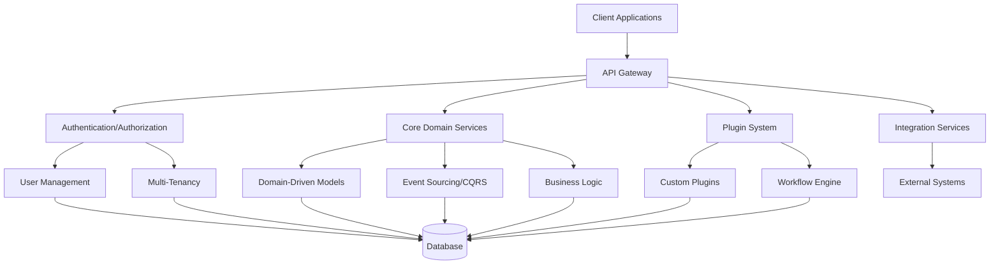

# 1. Title: PRD for ACCI Nest Enterprise Application Framework

<version>1.0.0</version>

## Status: Approved

## Intro

This PRD defines the requirements and goals for the ACCI Nest Enterprise Application Framework. The framework is designed to serve as a robust foundation for various business applications, tailored for organizations seeking a flexible, secure, and scalable platform that streamlines software development and operation. It emphasizes reusability, seamless integration, and compliance with stringent security and privacy standards.

## Goals

- **Flexibility and Reusability**: Create an adaptable framework that scales with diverse products and evolving business requirements through a modular architecture.
- **Security and Compliance**: Implement enterprise-grade security features and support for regulatory compliance (e.g., GDPR).
- **Scalability and Availability**: Build a system that accommodates increasing user numbers and data volumes while maintaining high availability.
- **Integration and Extensibility**: Provide well-defined APIs for seamless integration with existing systems and a plugin architecture for extensibility.
- **User-Centric Experience**: Develop intuitive interfaces with multi-language support and automated workflows to enhance productivity.

## Success Criteria and KPIs

### Technical KPIs

- **Performance**:
  - API response time under 500ms for 95% of requests
  - Support for 100+ concurrent users with less than 1% error rate
  - Handles hundred thousands of database records without performance degradation
- **Scalability**:
  - Horizontal scaling to handle 10x traffic increase with proportional resource addition
  - 99.9% uptime during traffic spikes
- **Security**:
  - Zero critical vulnerabilities in security audits
  - 100% compliance with OWASP Top 10
  - SOC2 compliance readiness

### Business KPIs

- **Developer Productivity**:
  - 40% reduction in development time for common enterprise features
  - 60% reduction in boilerplate code compared to traditional frameworks
- **Integration Efficiency**:
  - Integration with new systems requires less than 5 developer days
  - 90% of common enterprise system integrations available out-of-the-box
- **Maintenance Costs**:
  - 30% reduction in maintenance costs compared to custom solutions
  - 50% reduction in time spent on security updates and patches

## User Personas

### Enterprise Application Developer

**Name**: Alex Johnson  
**Role**: Senior Full-Stack Developer  
**Technical Skills**: Experienced with TypeScript, Node.js, and frontend frameworks  
**Goals**:

- Rapidly build secure, scalable business applications
- Minimize boilerplate code
- Easily implement complex features like multi-tenancy and authentication
- Focus on business logic rather than infrastructure

**Key Pain Points**:

- Repetitive code for common patterns (authentication, logging, etc.)
- Difficulty maintaining consistent security practices across projects
- Time spent on infrastructure rather than business logic
- Complexity in implementing proper error handling and monitoring

**Key User Stories**:

- "As a developer, I want to create a new tenant-aware application with pre-built authentication so that I can focus on business logic."
- "As a developer, I want to extend the core framework with custom plugins without modifying the framework itself."
- "As a developer, I want comprehensive documentation and examples so that I can quickly implement complex features."

### System Administrator

**Name**: Jamie Rodriguez  
**Role**: DevOps Engineer  
**Technical Skills**: Docker, Docker Compose, CI/CD pipelines, monitoring systems  
**Goals**:

- Easy deployment and maintenance
- Clear monitoring and observability
- Reliable scaling during peak loads
- Minimal operational overhead

**Key Pain Points**:

- Insufficient monitoring and debugging information
- Complex deployment procedures
- Limited automation for routine maintenance tasks
- Difficulty managing service configurations across environments

**Key User Stories**:

- "As a system administrator, I want a dashboard that shows the health of all system components so that I can quickly identify issues."
- "As a system administrator, I want simplified service orchestration using Docker Compose so that I can manage deployments with minimal complexity."
- "As a system administrator, I want centralized logging with correlation IDs so that I can trace requests across multiple services."

### Enterprise Architect

**Name**: Sam Williams
**Role**: Enterprise Solution Architect  
**Technical Skills**: Broad knowledge of enterprise systems, APIs, security frameworks  
**Goals**:

- Ensure system meets compliance standards
- Guarantee seamless integration with existing enterprise systems
- Implement standardized patterns across the organization
- Future-proof technology decisions

**Key Pain Points**:

- Integration difficulties with legacy systems
- Compliance documentation and enforcement
- Inconsistent implementation of enterprise standards
- Technical debt accumulation in long-lived systems

**Key User Stories**:

- "As an architect, I want to enforce organizational security policies across all applications built with the framework."
- "As an architect, I want to define integration patterns that all services must follow to ensure system cohesion."
- "As an architect, I want comprehensive compliance reporting so that I can demonstrate adherence to regulatory requirements."

## Features and Requirements

### Core Features

- **User Management**
  - Authentication and authorization (OAuth2/OpenID Connect)
  - User profile management and preferences
  - Multi-factor authentication
  - Role-based access control (RBAC)
  - Session management

- **Multi-Tenancy**
  - Isolated tenant data with shared infrastructure
  - Tenant-specific configurations and customizations
  - Cross-tenant operations (when authorized)

- **License Management**
  - Token-based licensing system
  - Flexible license models (per-user, feature-based, etc.)
  - License usage monitoring and analytics
  - Automated license enforcement

- **Internationalization (i18n)**
  - Multi-language support throughout the application
  - Cultural and regional formatting (dates, numbers, currencies)
  - Dynamic language switching

- **Core Architecture & Domain Modeling**
  - Support for Domain-Driven Design (DDD) patterns
  - Event Sourcing capabilities for state change tracking
  - CQRS (Command Query Responsibility Segregation) implementation

- **API & Integration**
  - Dual API exposure (REST & GraphQL)
  - API versioning and documentation (OpenAPI/Swagger)
  - Integration connectors for external systems
    - HR/Directory Services
    - SMTP servers
    - Monitoring tools
    - Identity providers

- **Plugin Architecture & Workflow Engine**
  - Module-based extensibility
  - Custom business logic implementation
  - Configurable workflow processes
  - Event-driven architecture

### Non-functional Requirements

- **Security**
  - End-to-end encryption for sensitive data
  - Regular security audits and vulnerability scanning
  - Software Bill of Materials (SBOM) management
  - Adherence to OWASP Top 10 and ISO 27001

- **Performance**
  - Optimized response times and throughput
  - Caching strategies for frequently accessed data
  - Load balancing for distributed requests
  - Circuit breakers and retry policies

- **Scalability**
  - Horizontal scaling capabilities
  - Resource optimization under varying loads
  - Zero-downtime deployments

- **Monitoring and Observability**
  - Structured logging with correlation IDs
  - RED metrics (Rate, Errors, Duration)
  - Health check endpoints
  - Integrated alerting system

- **Compliance**
  - GDPR compliance features
  - Data retention policies
  - Audit trails for sensitive operations
  - Privacy by design

## Feature Prioritization

### MVP (Phase 1)

- Core framework setup and project structure
- Basic User Management (authentication, authorization)
- REST API endpoints with documentation
- Basic multi-tenancy implementation
- Core domain modeling infrastructure
- Initial security features implementation

### Phase 2

- GraphQL API implementation
- Enhanced multi-tenancy features
- Plugin system foundation
- Internationalization support
- Advanced user management features (MFA, RBAC)
- Monitoring and observability implementation

### Phase 3

- Workflow engine
- Complete license management system
- Advanced integration connectors
- Full CQRS and Event Sourcing capabilities
- Advanced compliance features
- Performance optimization features

## Implementation Roadmap

| Phase | Timeline | Major Deliverables |
|-------|----------|-------------------|
| **Inception** | Week 1-2 | Project setup, infrastructure decisions, architecture validation |
| **MVP (Phase 1)** | Week 3-8 | Core features, basic user management, REST API, multi-tenancy foundation |
| **Phase 2** | Week 9-16 | GraphQL, enhanced features, plugin system, internationalization |
| **Phase 3** | Week 17-24 | Advanced features, optimization, compliance features |
| **Stabilization** | Week 25-28 | Performance tuning, documentation, security audits |

## Epic List

### Epic-1: Core Framework Setup and Domain Architecture

### Epic-2: User Management and Multi-Tenancy

### Epic-3: API Gateway and Integration Services

### Epic-4: Plugin System and Workflow Engine

### Epic-5: Security, Compliance, and Monitoring

### Epic-N: Future Enhancements (Beyond Scope of current PRD)

## Epic Stories

### Epic-1: Core Framework Setup and Domain Architecture

- Story 1: NestJS Project Initialization
  Status: ''
  Requirements:
  - Set up NestJS framework with TypeScript
  - Configure project structure following modular patterns
  - Implement dependency injection foundation

- Story 2: Domain-Driven Design Implementation
  Status: ''
  Requirements:
  - Define core domain entities and value objects
  - Implement repositories and services pattern
  - Set up event sourcing infrastructure

- Story 3: Database Integration and ORM Setup
  Status: ''
  Requirements:
  - Configure PostgreSQL connections
  - Set up TypeORM/Prisma integration
  - Implement migration system
  - Create data access layer

- Story 4: Caching and Performance Foundation
  Status: ''
  Requirements:
  - Integrate Redis for caching
  - Implement caching strategies
  - Set up performance monitoring foundations
  - Create cache invalidation mechanisms

### Epic-2: User Management and Multi-Tenancy

- Story 1: Authentication System
  Status: ''
  Requirements:
  - Implement OAuth2/OpenID Connect support
  - Set up Passport.js integration
  - Create JWT token handling
  - Build refresh token mechanisms

- Story 2: User Management Service
  Status: ''
  Requirements:
  - Create user CRUD operations
  - Implement user profile management
  - Build user preferences system
  - Set up password policies and recovery workflows

- Story 3: Multi-Tenancy Foundation
  Status: ''
  Requirements:
  - Implement tenant isolation strategies
  - Create tenant-aware repositories
  - Set up tenant configuration system
  - Build tenant administration interfaces

- Story 4: Role-Based Access Control
  Status: ''
  Requirements:
  - Define role and permission models
  - Implement RBAC middleware
  - Create permission management system
  - Build decorators for permission checking

### Epic-3: API Gateway and Integration Services

- Story 1: REST API Implementation
  Status: ''
  Requirements:
  - Set up OpenAPI/Swagger documentation
  - Implement versioning strategy
  - Create standardized response formats
  - Build error handling patterns

- Story 2: GraphQL API Implementation
  Status: ''
  Requirements:
  - Set up GraphQL schema and resolvers
  - Implement DataLoader for efficient queries
  - Create subscription support for real-time features
  - Build GraphQL-specific authorization

- Story 3: External Service Integration
  Status: ''
  Requirements:
  - Create abstraction layer for third-party services
  - Implement SMTP integration
  - Build identity provider connectors
  - Set up monitoring tool integration

### Epic-4: Plugin System and Workflow Engine

- Story 1: Plugin Architecture Foundation
  Status: ''
  Requirements:
  - Design plugin interface and lifecycle
  - Create plugin registration system
  - Implement plugin discovery mechanism
  - Build plugin configuration management

- Story 2: Workflow Engine
  Status: ''
  Requirements:
  - Design workflow definition format
  - Implement workflow execution engine
  - Create workflow state management
  - Build workflow administration tools

### Epic-5: Security, Compliance, and Monitoring

- Story 1: Security Infrastructure
  Status: ''
  Requirements:
  - Implement encryption for sensitive data
  - Set up security headers and CSRF protection
  - Create rate limiting mechanisms
  - Build security audit logging

- Story 2: Compliance Features
  Status: ''
  Requirements:
  - Implement GDPR compliance tools
  - Create data retention policies
  - Build consent management system
  - Implement data export and deletion features

- Story 3: Monitoring and Observability
  Status: ''
  Requirements:
  - Set up structured logging with correlation IDs
  - Implement health check endpoints
  - Create performance metrics collection
  - Build alerting integrations

## Risk Analysis

| Risk | Impact | Probability | Mitigation Strategy |
|------|--------|------------|---------------------|
| **Architectural Complexity** | High | Medium | Maintain clear documentation, use proven patterns, conduct regular architecture reviews |
| **Performance Bottlenecks** | High | Medium | Establish performance benchmarks early, test with representative data volumes, implement monitoring |
| **Security Vulnerabilities** | High | Medium | Regular security audits, dependency scanning, penetration testing, security-focused code reviews |
| **Integration Challenges** | Medium | High | Define clear interface contracts, build integration test suite, implement graceful degradation |
| **Scope Creep** | Medium | High | Rigorous prioritization process, clear MVP definition, phased approach with regular reviews |
| **Technical Debt** | Medium | Medium | Establish coding standards, regular refactoring cycles, automated code quality checks |
| **Team Skill Gaps** | Medium | Low | Knowledge sharing sessions, provide learning resources, targeted training for complex aspects |
| **Dependency on External Services** | Low | Medium | Build abstraction layers, implement fallback mechanisms, have contingency plans for external failures |

## Test and QA Strategy

### Testing Levels

- **Unit Testing**: All services, repositories, and utilities must have unit tests with >80% coverage
- **Integration Testing**: All API endpoints and service integrations must have integration tests
- **End-to-End Testing**: Core user journeys must have E2E tests
- **Performance Testing**: API endpoints must be tested for performance under expected load
- **Security Testing**: Regular OWASP ZAP scans and manual penetration testing

### Testing Tools and Approaches

- **Unit & Integration**: Jest with TypeScript support
- **E2E**: Supertest for API testing, Cypress for UI testing if applicable
- **Performance**: k6 for load testing
- **Security**: OWASP ZAP, npm audit, Snyk

### QA Processes

- Automated tests run on every PR
- Code review required before merging
- Performance and security testing performed before major releases
- Regular security audits and vulnerability scans
- Acceptance criteria defined for each story before development

## Deployment Strategy

### Environments

- **Development**: For active development and feature integration
- **Staging**: Mirror of production for final testing
- **Production**: Live environment with scaled resources

### CI/CD Pipeline

- **Build**: Automated on commit to development branches
- **Test**: Run unit, integration, and E2E tests
- **Security Scan**: Analyze dependencies and code for vulnerabilities
- **Deploy to Dev**: Automatic on successful build and tests
- **Deploy to Staging**: Manual trigger after QA approval
- **Deploy to Production**: Manual trigger with approval process

### Infrastructure

- Docker containers for consistent deployment
- Docker Compose for service orchestration and multi-container applications
- Environment-specific configuration management with .env files
- Zero-downtime deployment strategy with rolling updates

## Technology Stack

| Technology | Description |
| ------------ | ------------------------------------------------------------- |
| NestJS | Progressive Node.js framework for building server-side applications |
| TypeScript | Typed superset of JavaScript for enhanced developer experience |
| PostgreSQL | Primary database for persistent storage |
| Redis | In-memory data structure store for caching and pub/sub |
| Docker | Containerization for consistent development and deployment |
| TypeORM/Prisma | ORM for database interaction and migrations |
| Jest | Testing framework for unit and integration tests |
| Passport.js | Authentication middleware for Node.js |
| GraphQL | Query language for APIs alongside REST |
| Swagger/OpenAPI | API documentation and testing |

## Reference

### System Architecture Overview



## Data Models, API Specs, Schemas, etc

### Core User Entity Schema

```typescript
interface User {
  id: string;
  email: string;
  profile: {
    firstName: string;
    lastName: string;
    preferredLanguage: string;
  };
  tenantId: string;
  roles: Role[];
  authFactors: AuthFactor[];
  created: Date;
  updated: Date;
}
```

### Authentication API Endpoints

```typescript
/**
 * @route POST /auth/login
 * @group Authentication - Operations about user authentication
 * @param {string} email.body.required - User's email
 * @param {string} password.body.required - User's password
 * @returns {object} 200 - Access and refresh tokens
 * @returns {Error} 401 - Invalid credentials
 */

/**
 * @route POST /auth/refresh
 * @group Authentication - Operations about user authentication
 * @param {string} token.body.required - Refresh token
 * @returns {object} 200 - New access token
 * @returns {Error} 401 - Invalid or expired refresh token
 */

/**
 * @route POST /auth/logout
 * @group Authentication - Operations about user authentication
 * @param {string} token.header.required - JWT token
 * @returns {object} 200 - Successfully logged out
 */
```

### Tenant Management API Endpoints

```typescript
/**
 * @route GET /tenants
 * @group Tenants - Operations about multi-tenancy
 * @param {string} token.header.required - JWT token
 * @returns {Array<Tenant>} 200 - List of tenants
 * @returns {Error} 401 - Unauthorized
 */

/**
 * @route POST /tenants
 * @group Tenants - Operations about multi-tenancy
 * @param {string} token.header.required - JWT token
 * @param {Tenant} tenant.body.required - Tenant to create
 * @returns {Tenant} 201 - Created tenant
 * @returns {Error} 401 - Unauthorized
 */

/**
 * @route GET /tenants/{id}
 * @group Tenants - Operations about multi-tenancy
 * @param {string} token.header.required - JWT token
 * @param {string} id.path.required - Tenant ID
 * @returns {Tenant} 200 - Tenant details
 * @returns {Error} 401 - Unauthorized
 * @returns {Error} 404 - Tenant not found
 */
```

## Project Structure

```text
src/
├── main.ts                    # Application entry point
├── app.module.ts              # Root application module
├── config/                    # Configuration and environment setup
├── common/                    # Shared utilities, decorators, and filters
├── core/                      # Core framework functionality
│   ├── user-management/       # User authentication and profile
│   ├── multi-tenancy/         # Multi-tenant infrastructure
│   ├── licensing/             # License management
│   └── i18n/                  # Internationalization
├── domain/                    # Domain-driven design implementation
│   ├── entities/              # Domain entities
│   ├── value-objects/         # Value objects
│   ├── repositories/          # Data access repositories
│   └── services/              # Domain services
├── api/                       # API exposure
│   ├── rest/                  # REST controllers
│   └── graphql/               # GraphQL resolvers and schemas
├── integration/               # External system integrations
│   ├── smtp/                  # Email service integration
│   ├── identity/              # Identity provider connectors
│   └── monitoring/            # Monitoring integration
├── plugins/                   # Plugin architecture
│   ├── engine/                # Plugin system core
│   └── workflow/              # Workflow management
└── infrastructure/            # Technical infrastructure
    ├── database/              # Database configuration and migrations
    ├── caching/               # Caching mechanisms
    ├── event-sourcing/        # Event sourcing implementation
    └── messaging/             # Message bus for pub/sub
```

## Change Log

| Change | Story ID | Description |
| -------------------- | -------- | ------------------------------------------------------------- |
| Initial draft | N/A | Initial draft of the PRD |
| Translation to English | N/A | Translation of the PRD from German to English |
| Updated Goals | N/A | Incorporated detailed goals from GOALS.md |
| Added Features | N/A | Extracted and adapted features from architecture document |
| Expanded PRD | N/A | Added success criteria, roadmap, risks, detailed stories, and more |
| Enhanced Details | N/A | Added detailed sections on multi-tenancy, plugin system, workflow engine, and security architecture |
| Infrastructure Update | N/A | Updated deployment infrastructure to use Docker Compose instead of Kubernetes and Terraform |

## Multi-Tenancy Architecture Details

The multi-tenancy architecture is a critical component of the framework, allowing multiple organizations to use the same application instance while maintaining data isolation. We will implement a hybrid approach that combines the benefits of different multi-tenancy models:

### Tenant Identification and Resolution

- **Tenant Resolution Strategies**:
  - URL-based resolution (subdomain or path parameter)
  - Header-based resolution (`X-Tenant-ID` header)
  - JWT claim-based resolution (embedded in authentication token)
  - Dynamic resolution based on configuration
  
- **Tenant Context Management**:
  - Context propagation through request pipeline
  - AsyncLocalStorage for maintaining tenant context across asynchronous operations
  - Thread-safe tenant context storage for request handling

### Data Isolation Strategies

- **Database-Level Isolation**:
  - **Schema Separation**: Each tenant gets its own schema within a shared database
  - **Connection Management**: Dynamically resolve database connections based on tenant
  - **Query Interceptors**: Automatically apply tenant filters to all database queries
  
- **Application-Level Isolation**:
  - Tenant-aware repositories that automatically scope queries to the current tenant
  - Middleware for validating tenant access to resources
  - Service-layer isolation enforcement

### Multi-Tenancy Implementation Components

```typescript
// Tenant identification interface
interface TenantIdentificationStrategy {
  identifyTenant(request: Request): Promise<string>;
}

// Tenant-aware repository base class
abstract class TenantAwareRepository<T> {
  constructor(
    @InjectRepository(EntityClass) private repository: Repository<T>,
    @Inject(TENANT_CONTEXT) private tenantContext: TenantContext,
  ) {}
  
  findAll(): Promise<T[]> {
    return this.repository.find({
      where: { tenantId: this.tenantContext.getCurrentTenant() },
    });
  }
  
  // Other repository methods with tenant filtering
}

// Tenant middleware
@Injectable()
export class TenantMiddleware implements NestMiddleware {
  constructor(
    private tenantResolver: TenantResolver,
    private tenantContext: TenantContext,
  ) {}
  
  async use(req: Request, res: Response, next: NextFunction) {
    const tenantId = await this.tenantResolver.resolveTenant(req);
    this.tenantContext.setCurrentTenant(tenantId);
    next();
  }
}
```

### Cross-Tenant Operations

- **Controlled Access**: Specific endpoints and operations designed for cross-tenant access
- **Super Admin Role**: Special roles with permissions to access multiple tenants
- **Audit Logging**: Comprehensive logging of all cross-tenant operations
- **Data Aggregation**: Special query capabilities for authorized aggregation across tenants

## Plugin System Architecture

The plugin system is designed to provide extensibility without requiring modifications to the core framework. It allows developers to add custom functionality, integrate with external systems, and tailor the framework to specific business needs.

### Plugin System Components

- **Plugin Registry**: Central registry of all installed plugins with metadata
- **Plugin Lifecycle Hooks**: Standardized hooks for initialization, runtime, and shutdown
- **Plugin Configuration Management**: System for managing plugin-specific configurations
- **Plugin Dependency Resolution**: Management of dependencies between plugins

### Plugin Types

1. **Core Extensions**: Enhance or modify core framework functionality
2. **Integration Connectors**: Connect to external systems and services
3. **UI Components**: Extend the user interface with custom components
4. **Workflow Actions**: Custom actions for the workflow engine
5. **Security Enhancements**: Add additional security features or integrations

### Plugin Development and Distribution

- **Plugin SDK**: Development kit with tools and interfaces for building plugins
- **Plugin Packaging**: Standardized format for packaging and distributing plugins
- **Plugin Marketplace**: Centralized repository for discovering and installing plugins
- **Plugin Versioning**: Semantic versioning support for managing plugin compatibility

### Plugin Implementation Example

```typescript
// Plugin interface definition
export interface Plugin {
  id: string;
  name: string;
  version: string;
  dependencies?: string[];
  initialize(app: INestApplication): Promise<void>;
  onShutdown?(): Promise<void>;
}

// Plugin registration system
@Injectable()
export class PluginRegistry {
  private plugins: Map<string, Plugin> = new Map();
  
  registerPlugin(plugin: Plugin): void {
    // Validate plugin, check dependencies
    this.plugins.set(plugin.id, plugin);
  }
  
  getPlugin(id: string): Plugin | undefined {
    return this.plugins.get(id);
  }
  
  getAllPlugins(): Plugin[] {
    return Array.from(this.plugins.values());
  }
  
  async initializePlugins(app: INestApplication): Promise<void> {
    // Initialize plugins in dependency order
    for (const plugin of this.getSortedPlugins()) {
      await plugin.initialize(app);
    }
  }
  
  private getSortedPlugins(): Plugin[] {
    // Sort plugins based on dependencies
    // Implementation omitted for brevity
  }
}

// Example plugin implementation
export class EmailNotificationPlugin implements Plugin {
  id = 'email-notification-plugin';
  name = 'Email Notification Plugin';
  version = '1.0.0';
  dependencies = ['user-management-plugin'];
  
  async initialize(app: INestApplication): Promise<void> {
    // Register providers, controllers, etc.
    const moduleRef = app.get(ModuleRef);
    const userService = moduleRef.get(UserService);
    
    // Add notification handlers
    // Set up email templates
    // Configure email delivery
  }
  
  async onShutdown(): Promise<void> {
    // Clean up resources
  }
}
```

## Workflow Engine Architecture

The workflow engine enables the creation of complex business processes with customizable steps, conditions, and actions. It provides a visual editor for designing workflows and an execution engine for running them.

### Workflow Components

- **Workflow Definitions**: JSON-based definitions of workflows and their steps
- **Workflow Engine**: Core system for executing workflow definitions
- **Workflow Designer**: Visual interface for creating and editing workflows
- **Workflow Runtime**: Execution environment for workflow instances
- **Workflow Storage**: Persistence layer for workflow definitions and instances

### Workflow Features

1. **Visual Design**: Drag-and-drop interface for designing workflows
2. **Conditional Branching**: Decision nodes for dynamic process flows
3. **Parallel Execution**: Support for parallel task execution
4. **Human Tasks**: Tasks requiring human approval or input
5. **Integration Actions**: Pre-built actions for system integrations
6. **Custom Extensions**: Plugin system for custom workflow actions
7. **Versioning**: Support for workflow versioning and migration
8. **Monitoring**: Real-time monitoring of workflow execution

### Workflow Definition Example

```json
{
  "id": "customer-onboarding",
  "name": "Customer Onboarding Process",
  "version": "1.0.0",
  "startNode": "create-customer",
  "nodes": [
    {
      "id": "create-customer",
      "type": "action",
      "action": "createCustomer",
      "next": "verify-email"
    },
    {
      "id": "verify-email",
      "type": "wait",
      "event": "email-verified",
      "timeout": {
        "duration": "24h",
        "next": "send-reminder"
      },
      "next": "create-account"
    },
    {
      "id": "send-reminder",
      "type": "action",
      "action": "sendReminderEmail",
      "next": "verify-email"
    },
    {
      "id": "create-account",
      "type": "action",
      "action": "createUserAccount",
      "next": "decision-kyc"
    },
    {
      "id": "decision-kyc",
      "type": "decision",
      "condition": "customer.requiresKYC",
      "true": "perform-kyc",
      "false": "activate-account"
    },
    {
      "id": "perform-kyc",
      "type": "human-task",
      "assignTo": "compliance-team",
      "form": "kyc-verification-form",
      "next": "activate-account"
    },
    {
      "id": "activate-account",
      "type": "action",
      "action": "activateCustomerAccount",
      "next": "end"
    },
    {
      "id": "end",
      "type": "end"
    }
  ]
}
```

## Security Architecture

Security is a foundational aspect of the framework, implementing a defense-in-depth approach with multiple layers of protection. The security architecture addresses authentication, authorization, data protection, and compliance requirements.

### Authentication Architecture

- **Multi-Factor Authentication**: Support for various authentication factors
  - Knowledge factors (passwords, PINs)
  - Possession factors (OTP devices, SMS, email)
  - Inherence factors (biometric integration)
  
- **Identity Provider Integration**:
  - OAuth 2.0 / OpenID Connect support
  - SAML 2.0 support for enterprise SSO
  - Social login providers (configurable)
  - Custom identity provider integration

- **Token Management**:
  - JWT (JSON Web Token) based authentication
  - Refresh token rotation for enhanced security
  - Token revocation capabilities
  - Configurable token expiration policies

### Authorization Framework

- **Role-Based Access Control (RBAC)**:
  - Hierarchical role structure
  - Fine-grained permission system
  - Role inheritance
  - Dynamic role assignment

- **Attribute-Based Access Control (ABAC)**:
  - Policy-based authorization decisions
  - Context-aware access control
  - Dynamic permission evaluation

- **Multi-Level Authorization**:
  - Resource-level permissions
  - Field-level security
  - Operation-level authorization
  - Data-driven access control

### Data Protection

- **Encryption Solutions**:
  - Transport-level encryption (TLS)
  - Database-level encryption
  - Field-level encryption for sensitive data
  - Key management system

- **Data Access Controls**:
  - Row-level security
  - Column-level security
  - Dynamic data masking
  - Secure audit logging

### Security Implementation Components

```typescript
// Permission decorator for securing endpoints
export function RequirePermission(permission: string) {
  return applyDecorators(
    SetMetadata(PERMISSION_KEY, permission),
    UseGuards(PermissionGuard),
  );
}

// Permission guard implementation
@Injectable()
export class PermissionGuard implements CanActivate {
  constructor(
    private reflector: Reflector,
    private permissionService: PermissionService,
    private tenantContext: TenantContext,
  ) {}
  
  async canActivate(context: ExecutionContext): Promise<boolean> {
    const requiredPermission = this.reflector.get<string>(
      PERMISSION_KEY,
      context.getHandler(),
    );
    
    if (!requiredPermission) {
      return true;
    }
    
    const request = context.switchToHttp().getRequest();
    const user = request.user;
    const tenantId = this.tenantContext.getCurrentTenant();
    
    return this.permissionService.hasPermission(
      user.id,
      requiredPermission,
      tenantId,
    );
  }
}

// Field-level encryption service
@Injectable()
export class EncryptionService {
  constructor(
    private configService: ConfigService,
    private keyManagementService: KeyManagementService,
  ) {}
  
  async encryptField(data: string, context: EncryptionContext): Promise<string> {
    const key = await this.keyManagementService.getKey(context);
    // Encryption implementation
    return encryptedData;
  }
  
  async decryptField(data: string, context: EncryptionContext): Promise<string> {
    const key = await this.keyManagementService.getKey(context);
    // Decryption implementation
    return decryptedData;
  }
}
```
