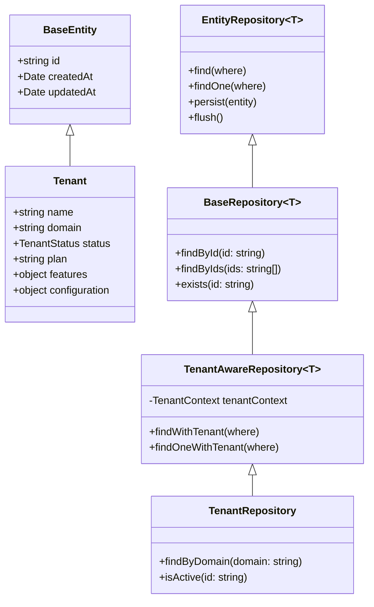
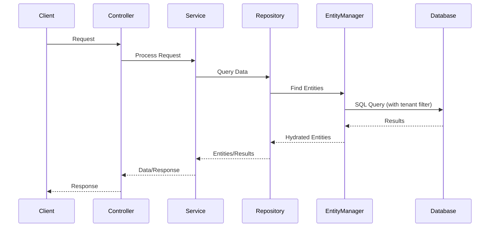

# Epic-1 - Story-3

Advanced Database Integration and Data Access Layer

**Als** Entwickler
**Möchte ich** eine vollständige Datenbankintegration und eine robuste Datenzugriffsschicht
**Damit** ich eine strukturierte, typsichere und wartbare Interaktion mit der Datenbank gewährleisten kann.

## Status

Draft

## Context

- Diese Story baut auf der grundlegenden MikroORM-Integration aus Story 2 auf.
- Während wir in Story 2 bereits die Basis für die Datenbankinteraktion gelegt haben (grundlegende MikroORM-Konfiguration, Base-Entity, Tenant-Entity), werden wir nun fortgeschrittenere Datenbankfunktionen implementieren.
- Die Datenzugriffsschicht soll nach dem Repository-Pattern organisiert werden, was mit dem Data-Mapper-Muster von MikroORM übereinstimmt.
- Die Infrastruktur für Migrationen wurde teilweise in Story 2 eingerichtet, benötigt aber Erweiterungen und Automatisierung.
- Wir werden in dieser Story auch ein Seeding-System für Testdaten implementieren.
- Die Multi-Tenancy-Anforderungen aus der PRD und der Architektur müssen in der Datenzugriffsschicht berücksichtigt werden.

## Estimation

Story Points: 3

## Tasks

1. - [ ] Repository Pattern Implementierung
   1. - [ ] Erstellen einer `BaseRepository`-Klasse, die von `EntityRepository` erbt und gemeinsame Funktionalität bietet.
   2. - [ ] Implementieren eines `TenantRepository` mit tenant-spezifischen Methoden.
   3. - [ ] Einrichten von Repository-Providern in entsprechenden Modulen.
   4. - [ ] Unit-Tests für Repository-Methoden schreiben.

2. - [ ] Erweiterung des Migrations-Systems
   1. - [ ] Erstellen einer Migrations-Strategie (Wann und wie Migrationen ausgeführt werden).
   2. - [ ] Implementieren von Skripten zur Automatisierung von Migrationen während der Deployment-Phase.
   3. - [ ] Sicherstellen, dass Migrationen auch für Multi-Tenancy funktionieren (Schema-Separation).

3. - [ ] Entwicklung eines Seeding-Systems
   1. - [ ] Erstellen einer `Seeder`-Basisklasse zur Definition der Seeding-Struktur.
   2. - [ ] Implementieren eines `DatabaseSeeder` für die Koordination aller Seeder.
   3. - [ ] Erstellen eines `TenantSeeder` für Basis-Tenant-Daten.
   4. - [ ] Skripte zur Ausführung von Seedern in verschiedenen Umgebungen.

4. - [ ] Optimierung der PostgreSQL-Verbindung
   1. - [ ] Konfiguration von Connection-Pooling mit angemessenen Limits.
   2. - [ ] Implementierung von Retry-Mechanismen für Datenbankverbindungen.
   3. - [ ] Logging und Monitoring der Datenbankinteraktionen.

5. - [ ] Unit of Work Pattern Implementierung
   1. - [ ] Korrekte Nutzung der MikroORM EntityManager für Unit-of-Work.
   2. - [ ] Entwicklung eines transaktionalen Services für komplexe Datenbankoperationen.
   3. - [ ] Implementierung von Fehlerbehandlung und Rollback-Strategien.

6. - [ ] Multi-Tenancy in der Datenzugriffsschicht
   1. - [ ] Implementierung einer `TenantAwareRepository`-Klasse, die Tenant-ID-Filter automatisch anwendet.
   2. - [ ] Entwicklung eines `TenantContext`-Service zur Tenant-Identifikation.
   3. - [ ] Integration der Tenant-Filterung in Repositories und Queries.

7. - [ ] Erweiterung der Datenbank-Gesundheitsüberprüfung
   1. - [ ] Implementierung umfassenderer Datenbank-Gesundheitschecks.
   2. - [ ] Hinzufügen von Datenbankstatistiken zum Health-Endpoint.
   3. - [ ] Überprüfung der Migrationsversion im Health-Check.

## Constraints

- MikroORM als exklusive ORM-Lösung verwenden.
- Domain-Driven Design Prinzipien einhalten.
- Die Datenbankabstraktion sollte die Geschäftslogik nicht beeinflussen.
- Multi-Tenancy-Anforderungen müssen durchgängig berücksichtigt werden.
- Klare Trennung von Zuständigkeiten zwischen Repositories, Services und Controllern.
- PostgreSQL-spezifische Funktionen nutzen, wo sie Vorteile bieten.
- Test-gesteuerte Entwicklung für Repository-Implementierungen.

## Data Models / Schema

### BaseRepository

```typescript
import { EntityRepository, FilterQuery } from '@mikro-orm/core';
import { BaseEntity } from '../entities/base.entity';

export class BaseRepository<T extends BaseEntity> extends EntityRepository<T> {
  async findById(id: string): Promise<T | null> {
    return this.findOne({ id } as FilterQuery<T>);
  }

  async findByIds(ids: string[]): Promise<T[]> {
    return this.find({ id: { $in: ids } } as FilterQuery<T>);
  }

  async exists(id: string): Promise<boolean> {
    const count = await this.count({ id } as FilterQuery<T>);
    return count > 0;
  }

  // Weitere gemeinsame Methoden...
}
```

### TenantAwareRepository

```typescript
import { FilterQuery } from '@mikro-orm/core';
import { Inject, Injectable } from '@nestjs/common';
import { BaseRepository } from './base.repository';
import { BaseEntity } from '../entities/base.entity';
import { TENANT_CONTEXT } from '../constants';
import { TenantContext } from '../tenants/tenant-context.service';

export abstract class TenantAwareRepository<T extends BaseEntity> extends BaseRepository<T> {
  constructor(
    @Inject(TENANT_CONTEXT) private readonly tenantContext: TenantContext
  ) {
    super();
  }

  async findWithTenant(where: FilterQuery<T> = {}): Promise<T[]> {
    const tenantId = this.tenantContext.getCurrentTenant();
    return this.find({ ...where, tenantId } as FilterQuery<T>);
  }

  async findOneWithTenant(where: FilterQuery<T> = {}): Promise<T | null> {
    const tenantId = this.tenantContext.getCurrentTenant();
    return this.findOne({ ...where, tenantId } as FilterQuery<T>);
  }

  // Weitere tenant-spezifische Methoden...
}
```

### DatabaseSeeder Struktur

```typescript
import { EntityManager } from '@mikro-orm/core';
import { Seeder } from '@mikro-orm/seeder';

export abstract class BaseSeeder extends Seeder {
  abstract seed(em: EntityManager): Promise<void>;
  abstract truncate(em: EntityManager): Promise<void>;
}

export class DatabaseSeeder extends Seeder {
  async run(em: EntityManager): Promise<void> {
    await new TenantSeeder().seed(em);
    // Weitere Seeder...
  }
}

export class TenantSeeder extends BaseSeeder {
  async seed(em: EntityManager): Promise<void> {
    // Implementierung des Tenant-Seeding
  }

  async truncate(em: EntityManager): Promise<void> {
    // Implementierung des Tenant-Truncating
  }
}
```

## Structure

- Erweiterung von `src/backend/src/common/repositories/`:
  - `base.repository.ts`
  - `tenant-aware.repository.ts`
- Erweiterung von `src/backend/src/tenants/`:
  - `repositories/tenant.repository.ts`
  - `tenant-context.service.ts`
- Erstellen von `src/backend/seeders/`:
  - `database.seeder.ts`
  - `tenant.seeder.ts`
- Anpassung von `src/backend/mikro-orm.config.ts` für Verbindungsoptimierung.
- Erweiterung von `src/backend/src/app.service.ts` für verbesserte Health-Checks.

## Diagrams





## Dev Notes

- Die `BaseRepository` und `TenantAwareRepository` bilden das Fundament der Datenzugriffsschicht und sollten sorgfältig implementiert werden.
- Das Unit-of-Work-Muster von MikroORM (über EntityManager) sollte konsequent genutzt werden, um Transaktionen und Datenintegrität zu gewährleisten.
- Die Testdatengeneration über Seeder ist essenziell für Entwicklungs- und Testumgebungen, sollte aber konfigurierbar sein, um nicht in Produktionsumgebungen zu laufen.
- Bei der Optimierung der PostgreSQL-Verbindungen ist auf geeignete Pool-Größen zu achten, abhängig von der erwarteten Last und den Serverressourcen.
- Die Multi-Tenancy-Implementierung muss sorgfältig gestaltet werden, um Datenisolation zu gewährleisten und gleichzeitig Abfragen effizient zu halten.
- Die Migration-Strategie sollte sowohl automatisierte Deployments als auch manuelle Entwicklungsworkflows unterstützen.

## Chat Command Log

- User: ja, lass uns mit der planung der story beginnen
- Agent: Erstellung des Story-Dokuments für Epic-1 Story-3 "Advanced Database Integration and Data Access Layer".
