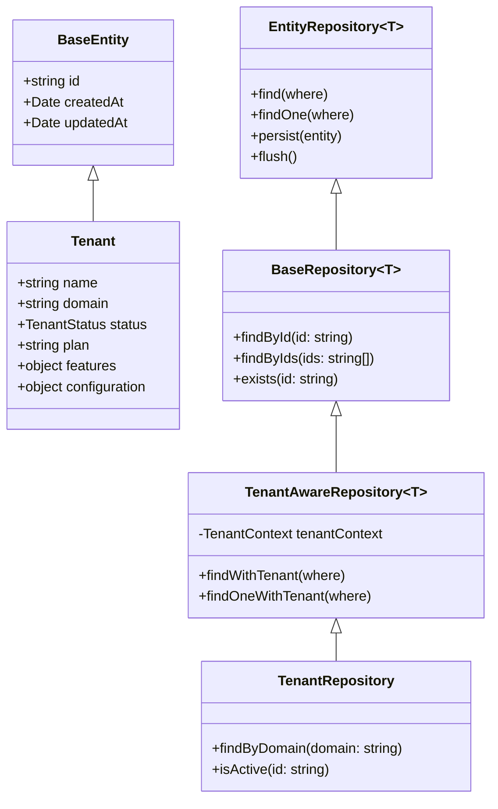
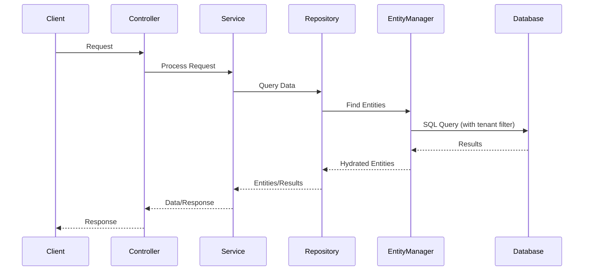

# Epic-1 - Story-3

Advanced Database Integration and Data Access Layer

**As a** developer
**I want** a complete database integration and robust data access layer
**So that** I can ensure structured, type-safe, and maintainable database interactions.

## Status

Draft

## Context

- This story builds upon the basic MikroORM integration from Story 2.
- While we have already established the foundation for database interaction in Story 2 (basic MikroORM configuration, Base Entity, Tenant Entity), we will now implement more advanced database functions.
- The data access layer should be organized according to the Repository Pattern, which aligns with MikroORM's Data Mapper pattern.
- The infrastructure for migrations was partially set up in Story 2 but requires extensions and automation.
- We will also implement a seeding system for test data in this story.
- The multi-tenancy requirements from the PRD and architecture must be considered in the data access layer.

## Estimation

Story Points: 3

## Tasks

1. - [ ] Repository Pattern Implementation
   1. - [ ] Create a `BaseRepository` class that extends `EntityRepository` and provides common functionality.
   2. - [ ] Implement a `TenantRepository` with tenant-specific methods.
   3. - [ ] Set up repository providers in the appropriate modules.
   4. - [ ] Write unit tests for repository methods.

2. - [ ] Extension of the Migration System
   1. - [ ] Create a migration strategy (when and how migrations are executed).
   2. - [ ] Implement scripts to automate migrations during the deployment phase.
   3. - [ ] Ensure that migrations also work for multi-tenancy (schema separation).

3. - [ ] Development of a Seeding System
   1. - [ ] Create a `Seeder` base class to define the seeding structure.
   2. - [ ] Implement a `DatabaseSeeder` for coordinating all seeders.
   3. - [ ] Create a `TenantSeeder` for base tenant data.
   4. - [ ] Create scripts to run seeders in different environments.

4. - [ ] Optimization of the PostgreSQL Connection
   1. - [ ] Configure connection pooling with appropriate limits.
   2. - [ ] Implement retry mechanisms for database connections.
   3. - [ ] Add logging and monitoring of database interactions.

5. - [ ] Unit of Work Pattern Implementation
   1. - [ ] Correct use of the MikroORM EntityManager for Unit of Work.
   2. - [ ] Development of a transactional service for complex database operations.
   3. - [ ] Implementation of error handling and rollback strategies.

6. - [ ] Multi-Tenancy in the Data Access Layer
   1. - [ ] Implementation of a `TenantAwareRepository` class that automatically applies tenant ID filters.
   2. - [ ] Development of a `TenantContext` service for tenant identification.
   3. - [ ] Integration of tenant filtering in repositories and queries.

7. - [ ] Enhancement of Database Health Checks
   1. - [ ] Implementation of more comprehensive database health checks.
   2. - [ ] Adding database statistics to the health endpoint.
   3. - [ ] Checking the migration version in the health check.

## Constraints

- Use MikroORM as the exclusive ORM solution.
- Adhere to Domain-Driven Design principles.
- The database abstraction should not influence business logic.
- Multi-tenancy requirements must be considered throughout.
- Clear separation of responsibilities between repositories, services, and controllers.
- Utilize PostgreSQL-specific functions where they offer advantages.
- Test-driven development for repository implementations.

## Data Models / Schema

### BaseRepository

```typescript
import { EntityRepository, FilterQuery } from '@mikro-orm/core';
import { BaseEntity } from '../entities/base.entity';

export class BaseRepository<T extends BaseEntity> extends EntityRepository<T> {
  async findById(id: string): Promise<T | null> {
    return this.findOne({ id } as FilterQuery<T>);
  }

  async findByIds(ids: string[]): Promise<T[]> {
    return this.find({ id: { $in: ids } } as FilterQuery<T>);
  }

  async exists(id: string): Promise<boolean> {
    const count = await this.count({ id } as FilterQuery<T>);
    return count > 0;
  }

  // Additional common methods...
}
```

### TenantAwareRepository

```typescript
import { FilterQuery } from '@mikro-orm/core';
import { Inject, Injectable } from '@nestjs/common';
import { BaseRepository } from './base.repository';
import { BaseEntity } from '../entities/base.entity';
import { TENANT_CONTEXT } from '../constants';
import { TenantContext } from '../tenants/tenant-context.service';

export abstract class TenantAwareRepository<T extends BaseEntity> extends BaseRepository<T> {
  constructor(
    @Inject(TENANT_CONTEXT) private readonly tenantContext: TenantContext
  ) {
    super();
  }

  async findWithTenant(where: FilterQuery<T> = {}): Promise<T[]> {
    const tenantId = this.tenantContext.getCurrentTenant();
    return this.find({ ...where, tenantId } as FilterQuery<T>);
  }

  async findOneWithTenant(where: FilterQuery<T> = {}): Promise<T | null> {
    const tenantId = this.tenantContext.getCurrentTenant();
    return this.findOne({ ...where, tenantId } as FilterQuery<T>);
  }

  // Additional tenant-specific methods...
}
```

### DatabaseSeeder Structure

```typescript
import { EntityManager } from '@mikro-orm/core';
import { Seeder } from '@mikro-orm/seeder';

export abstract class BaseSeeder extends Seeder {
  abstract seed(em: EntityManager): Promise<void>;
  abstract truncate(em: EntityManager): Promise<void>;
}

export class DatabaseSeeder extends Seeder {
  async run(em: EntityManager): Promise<void> {
    await new TenantSeeder().seed(em);
    // Additional seeders...
  }
}

export class TenantSeeder extends BaseSeeder {
  async seed(em: EntityManager): Promise<void> {
    // Implementation of tenant seeding
  }

  async truncate(em: EntityManager): Promise<void> {
    // Implementation of tenant truncating
  }
}
```

## Structure

- Extension of `src/backend/src/common/repositories/`:
  - `base.repository.ts`
  - `tenant-aware.repository.ts`
- Extension of `src/backend/src/tenants/`:
  - `repositories/tenant.repository.ts`
  - `tenant-context.service.ts`
- Creation of `src/backend/seeders/`:
  - `database.seeder.ts`
  - `tenant.seeder.ts`
- Modification of `src/backend/mikro-orm.config.ts` for connection optimization.
- Extension of `src/backend/src/app.service.ts` for improved health checks.

## Diagrams





## Dev Notes

- The `BaseRepository` and `TenantAwareRepository` form the foundation of the data access layer and should be carefully implemented.
- The Unit of Work pattern of MikroORM (via EntityManager) should be consistently used to ensure transactions and data integrity.
- Test data generation via seeders is essential for development and test environments but should be configurable to not run in production environments.
- When optimizing PostgreSQL connections, pay attention to appropriate pool sizes depending on expected load and server resources.
- The multi-tenancy implementation must be carefully designed to ensure data isolation while keeping queries efficient.
- The migration strategy should support both automated deployments and manual development workflows.

## Chat Command Log

- User: ja, lass uns mit der planung der story beginnen
- Agent: Creation of the story document for Epic-1 Story-3 "Advanced Database Integration and Data Access Layer".
- User: wieso ist die story auf deutsch???
- Agent: Corrected the story document, rewriting it in English as per project documentation standards.
