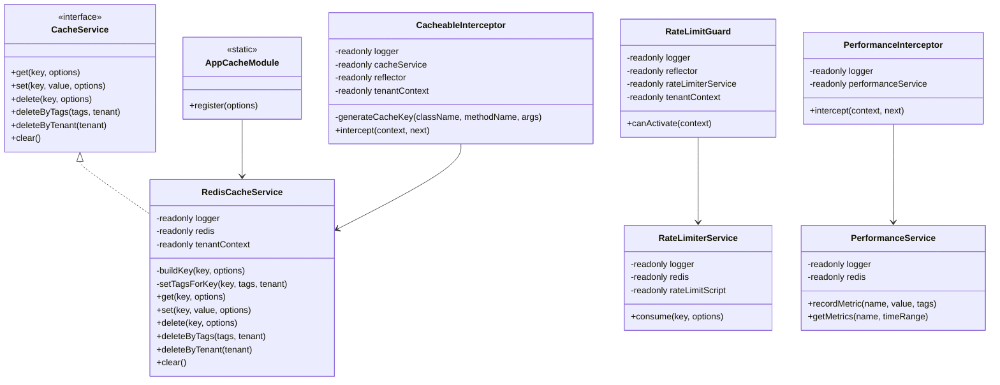
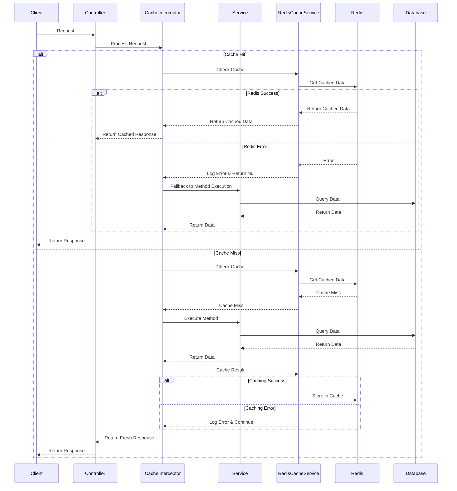

# Epic-1 - Story-4

Caching and Performance Foundation

**As a** developer
**I want** comprehensive caching and performance optimization capabilities
**So that** the application can handle high loads efficiently with optimal response times.

## Status

Completed

## Context

- This story builds upon the database infrastructure established in Story 3.
- Performance optimization is critical for enterprise applications expected to handle substantial user loads.
- Redis will be integrated as the primary caching solution.
- Both application-level and database-level caching strategies need to be implemented.
- Cache invalidation patterns must be established to ensure data consistency.
- Performance monitoring foundations need to be implemented to identify bottlenecks.
- The multi-tenancy requirements must be considered in the caching implementation.

## Estimation

Story Points: 3

## Tasks

1. - [x] Redis Integration and Configuration
   1. - [x] Set up Redis in the Docker Compose environment.
   2. - [x] Create a Redis module and service in NestJS.
   3. - [x] Configure connection pooling and error handling.
   4. - [x] Implement Redis health checks.
   5. - [x] Set up Redis clustering for development and production.

2. - [x] Caching Strategy Implementation
   1. - [x] Create a CacheService abstraction.
   2. - [x] Implement cache key generation with tenant awareness.
   3. - [x] Develop cache interceptors for method-level caching.
   4. - [x] Build query result caching for database queries.
   5. - [x] Implement TTL (Time-To-Live) strategies for different data types.

3. - [x] Cache Invalidation Mechanisms
   1. - [x] Design a cache invalidation strategy.
   2. - [x] Implement event-based cache invalidation.
   3. - [x] Create cache dependencies tracking.
   4. - [x] Build cache tags for group invalidation.
   5. - [x] Develop tenant-specific cache clearing mechanisms.

4. - [x] Response Compression and Optimization
   1. - [x] Implement response compression middleware.
   2. - [x] Set up proper HTTP caching headers.
   3. - [x] Optimize payload sizes for API responses.
   4. - [x] Implement conditional requests (ETag, If-Modified-Since).

5. - [x] Performance Monitoring Setup
   1. - [x] Integrate basic performance metrics collection.
   2. - [x] Set up response time tracking for API endpoints.
   3. - [x] Create database query performance monitoring.
   4. - [x] Implement memory usage tracking.
   5. - [x] Add cache hit/miss ratio monitoring.

6. - [x] Multi-Tenancy in Caching
   1. - [x] Implement tenant-specific cache namespaces.
   2. - [x] Create tenant-aware cache keys.
   3. - [x] Build tenant isolation in shared cache instances.
   4. - [x] Configure tenant-specific cache size limits.

7. - [x] Rate Limiting Implementation
   1. - [x] Design and implement a rate limiting service.
   2. - [x] Create a rate limiting guard for API endpoints.
   3. - [x] Set up different rate limits by endpoint and user role.
   4. - [x] Implement response headers for rate limiting information.

## Constraints

- Use Redis as the primary caching solution.
- Ensure thread safety in all caching operations.
- Cache keys must incorporate tenant IDs to ensure data isolation.
- Performance overhead of caching mechanisms should be minimal.
- Implement proper error handling for caching failures.
- Cache invalidation must maintain data consistency.
- Follow the cache-aside pattern for database interaction.
- Monitoring should have minimal performance impact.

## Data Models / Schema

### CacheService Interface

```typescript
/**
 * Options for cache operations
 */
export interface CacheOptions {
  /** Time-to-live in seconds */
  ttl?: number;
  /** Tags for grouping cache entries */
  tags?: string[];
  /** Tenant ID for multi-tenancy support */
  tenant?: string;
}

/**
 * Core caching service interface
 * Provides methods for interacting with the cache system
 */
export interface CacheService {
  /**
   * Retrieves data from cache
   * @param key - Cache key to retrieve
   * @param options - Optional cache operation parameters
   * @returns The cached value or null if not found
   */
  get<T>(key: string, options?: CacheOptions): Promise<T | null>;
  
  /**
   * Stores data in cache
   * @param key - Cache key to store
   * @param value - Value to cache
   * @param options - Optional cache operation parameters
   */
  set<T>(key: string, value: T, options?: CacheOptions): Promise<void>;
  
  /**
   * Removes data from cache
   * @param key - Cache key to delete
   * @param options - Optional cache operation parameters
   */
  delete(key: string, options?: CacheOptions): Promise<void>;
  
  /**
   * Removes cache entries by tags
   * @param tags - Tags to match for deletion
   * @param tenant - Optional tenant ID for multi-tenancy
   */
  deleteByTags(tags: string[], tenant?: string): Promise<void>;
  
  /**
   * Removes all cache entries for a tenant
   * @param tenant - Tenant ID
   */
  deleteByTenant(tenant: string): Promise<void>;
  
  /**
   * Clears the entire cache
   */
  clear(): Promise<void>;
}
```

### RedisCacheService Implementation

```typescript
import { Injectable, Inject, Logger } from '@nestjs/common';
import { Redis, Pipeline } from 'ioredis';
import { REDIS_CLIENT, TENANT_CONTEXT } from '../constants';
import { TenantContext } from '../tenants/tenant-context.service';
import { CacheService, CacheOptions } from './cache.interface';

/**
 * Redis implementation of the CacheService interface
 * Provides caching functionality with multi-tenancy support
 */
@Injectable()
export class RedisCacheService implements CacheService {
  private readonly logger = new Logger(RedisCacheService.name);

  constructor(
    @Inject(REDIS_CLIENT) private readonly redis: Redis,
    @Inject(TENANT_CONTEXT) private readonly tenantContext: TenantContext
  ) {}

  /**
   * Builds a cache key with tenant awareness
   * @param key - Base cache key
   * @param options - Cache options that may include tenant ID
   * @returns Full cache key with tenant prefix if applicable
   */
  private buildKey(key: string, options?: CacheOptions): string {
    const tenant = options?.tenant || this.tenantContext.getCurrentTenantId();
    return tenant ? `tenant:${tenant}:${key}` : key;
  }

  /**
   * Associates tags with a cache key for later invalidation
   * @param key - Cache key to tag
   * @param tags - Tags to associate with key
   * @param tenant - Optional tenant ID
   */
  private async setTagsForKey(key: string, tags: string[], tenant?: string): Promise<void> {
    if (!tags || tags.length === 0) return;
    
    try {
      const pipeline = this.redis.pipeline();
      for (const tag of tags) {
        const tagKey = tenant ? `tag:${tenant}:${tag}` : `tag:${tag}`;
        pipeline.sadd(tagKey, key);
      }
      await pipeline.exec();
    } catch (error) {
      this.logger.error(`Failed to set tags for key ${key}`, error instanceof Error ? error.stack : String(error));
      // Continue execution - non-critical operation
    }
  }

  /**
   * Retrieves data from cache
   * @param key - Cache key to retrieve
   * @param options - Optional cache operation parameters
   * @returns The cached value or null if not found or on error
   */
  async get<T>(key: string, options?: CacheOptions): Promise<T | null> {
    try {
      const fullKey = this.buildKey(key, options);
      const value = await this.redis.get(fullKey);
      
      if (!value) return null;
      
      try {
        return JSON.parse(value) as T;
      } catch (parseError) {
        this.logger.warn(`Failed to parse cached value for key ${fullKey}`, parseError instanceof Error ? parseError.stack : String(parseError));
        return null;
      }
    } catch (error) {
      this.logger.error(`Cache get error for key ${key}`, error instanceof Error ? error.stack : String(error));
      return null; // Graceful degradation
    }
  }

  /**
   * Stores data in cache
   * @param key - Cache key to store
   * @param value - Value to cache
   * @param options - Optional cache operation parameters
   */
  async set<T>(key: string, value: T, options?: CacheOptions): Promise<void> {
    try {
      const fullKey = this.buildKey(key, options);
      let serializedValue: string;
      
      try {
        serializedValue = JSON.stringify(value);
      } catch (parseError) {
        this.logger.warn(`Failed to serialize value for key ${fullKey}`, parseError instanceof Error ? parseError.stack : String(parseError));
        return;
      }
      
      const pipeline = this.redis.pipeline();
      
      if (options?.ttl) {
        pipeline.set(fullKey, serializedValue, 'EX', options.ttl);
      } else {
        pipeline.set(fullKey, serializedValue);
      }
      
      await pipeline.exec();
      
      if (options?.tags && options.tags.length > 0) {
        await this.setTagsForKey(fullKey, options.tags, options?.tenant);
      }
    } catch (error) {
      this.logger.error(`Cache set error for key ${key}`, error instanceof Error ? error.stack : String(error));
      // Continue execution - application should work without cache
    }
  }

  /**
   * Removes data from cache
   * @param key - Cache key to delete
   * @param options - Optional cache operation parameters
   */
  async delete(key: string, options?: CacheOptions): Promise<void> {
    try {
      const fullKey = this.buildKey(key, options);
      await this.redis.del(fullKey);
    } catch (error) {
      this.logger.error(`Cache delete error for key ${key}`, error instanceof Error ? error.stack : String(error));
      // Continue execution - non-critical operation
    }
  }

  /**
   * Removes cache entries by tags
   * @param tags - Tags to match for deletion
   * @param tenant - Optional tenant ID for multi-tenancy
   */
  async deleteByTags(tags: string[], tenant?: string): Promise<void> {
    if (!tags || tags.length === 0) return;
    
    try {
      // Collect all keys to delete in a single pass
      const keysToDelete = new Set<string>();
      const tagsToDelete = new Set<string>();
      
      // First get all keys for each tag
      for (const tag of tags) {
        const tagKey = tenant ? `tag:${tenant}:${tag}` : `tag:${tag}`;
        tagsToDelete.add(tagKey);
        
        try {
          const keys = await this.redis.smembers(tagKey);
          keys.forEach(key => keysToDelete.add(key));
        } catch (innerError) {
          this.logger.warn(`Failed to get members for tag ${tagKey}`, innerError instanceof Error ? innerError.stack : String(innerError));
          // Continue with other tags
        }
      }
      
      // Then delete all collected keys and tags in one pipeline
      if (keysToDelete.size > 0 || tagsToDelete.size > 0) {
        const pipeline = this.redis.pipeline();
        
        if (keysToDelete.size > 0) {
          pipeline.del(...Array.from(keysToDelete));
        }
        
        if (tagsToDelete.size > 0) {
          pipeline.del(...Array.from(tagsToDelete));
        }
        
        await pipeline.exec();
      }
    } catch (error) {
      this.logger.error(`Failed to delete by tags: ${tags.join(', ')}`, error instanceof Error ? error.stack : String(error));
      // Continue execution - application should work without proper cache invalidation
    }
  }

  /**
   * Removes all cache entries for a tenant
   * Uses scan to handle large key sets efficiently
   * @param tenant - Tenant ID
   */
  async deleteByTenant(tenant: string): Promise<void> {
    if (!tenant) {
      this.logger.warn('Attempted to delete cache by tenant with empty tenant ID');
      return;
    }
    
    try {
      let cursor = '0';
      let keysCount = 0;
      
      do {
        // Scan for keys in batches to avoid blocking Redis
        const [nextCursor, keys] = await this.redis.scan(
          cursor,
          'MATCH', `tenant:${tenant}:*`,
          'COUNT', '100'
        );
        
        cursor = nextCursor;
        keysCount += keys.length;
        
        if (keys.length > 0) {
          await this.redis.del(...keys);
        }
      } while (cursor !== '0');
      
      this.logger.debug(`Deleted ${keysCount} cache entries for tenant ${tenant}`);
    } catch (error) {
      this.logger.error(`Failed to delete cache by tenant ${tenant}`, error instanceof Error ? error.stack : String(error));
      // Continue execution - application should work without proper cache invalidation
    }
  }

  /**
   * Clears the entire cache
   * Use with caution - flushes the entire Redis database
   */
  async clear(): Promise<void> {
    try {
      await this.redis.flushdb();
      this.logger.warn('Cache completely cleared');
    } catch (error) {
      this.logger.error('Failed to clear cache', error instanceof Error ? error.stack : String(error));
      // Continue execution - application should work without cache clearing
    }
  }
}
```

### Cache Module and Interceptor

```typescript
import { Module, CacheModule as NestCacheModule, DynamicModule } from '@nestjs/common';
import { ConfigModule, ConfigService } from '@nestjs/config';
import * as redisStore from 'cache-manager-redis-store';
import { CACHE_MANAGER } from '@nestjs/common';
import { REDIS_CLIENT } from '../constants';
import { RedisModule } from '../redis/redis.module';
import { RedisCacheService } from './redis-cache.service';

/**
 * Configuration options for the cache module
 */
export interface CacheModuleOptions {
  /** TTL in seconds */
  ttl?: number;
  /** Maximum number of items in cache */
  max?: number;
  /** Cache namespace prefix */
  prefix?: string;
}

/**
 * Module for caching functionality
 * Provides both NestJS built-in CacheModule and custom RedisCacheService
 */
@Module({})
export class AppCacheModule {
  /**
   * Creates a dynamic module for caching
   * @param options - Configuration options
   * @returns Dynamic module configuration
   */
  static register(options: CacheModuleOptions = {}): DynamicModule {
    return {
      module: AppCacheModule,
      imports: [
        NestCacheModule.registerAsync({
          imports: [ConfigModule, RedisModule],
          inject: [ConfigService, REDIS_CLIENT],
          useFactory: (configService: ConfigService, redisClient: any) => ({
            store: redisStore,
            ttl: options.ttl || configService.get('CACHE_TTL', 300),
            max: options.max || configService.get('CACHE_MAX_ITEMS', 10000),
            prefix: options.prefix || configService.get('CACHE_PREFIX', 'app:cache:'),
            client: redisClient,
          }),
        }),
        RedisModule,
      ],
      providers: [RedisCacheService],
      exports: [NestCacheModule, RedisCacheService],
    };
  }
}
```

```typescript
import { Injectable, NestInterceptor, ExecutionContext, CallHandler, Inject, Logger } from '@nestjs/common';
import { Reflector } from '@nestjs/core';
import { Observable, of } from 'rxjs';
import { tap, switchMap } from 'rxjs/operators';
import { RedisCacheService } from './redis-cache.service';
import { TENANT_CONTEXT } from '../constants';
import { TenantContext } from '../../tenants/tenant-context.service';
import { CACHE_TTL_METADATA, CACHE_TAGS_METADATA } from './cache.constants';

/**
 * Interceptor for method-level caching
 * Automatically caches method results based on metadata
 */
@Injectable()
export class CacheableInterceptor implements NestInterceptor {
  private readonly logger = new Logger(CacheableInterceptor.name);

  constructor(
    private readonly cacheService: RedisCacheService,
    private readonly reflector: Reflector,
    @Inject(TENANT_CONTEXT) private readonly tenantContext: TenantContext
  ) {}

  /**
   * Generates a cache key based on method parameters and tenant
   * @param className - Class name
   * @param methodName - Method name
   * @param args - Method arguments
   * @returns Generated cache key
   */
  private generateCacheKey<T extends unknown[]>(
    className: string,
    methodName: string,
    args: T
  ): string {
    const argsString = args.map(arg => {
      try {
        return typeof arg === 'object' ? JSON.stringify(arg) : String(arg);
      } catch (error) {
        this.logger.warn(`Failed to stringify argument`, error instanceof Error ? error.stack : String(error));
        return 'unstringifiable';
      }
    }).join(':');
    
    return `${className}:${methodName}:${argsString}`;
  }

  /**
   * Intercepts method execution for caching
   * @param context - Execution context
   * @param next - Call handler
   * @returns Observable with the method result (cached or fresh)
   */
  intercept<T>(context: ExecutionContext, next: CallHandler<T>): Observable<T> {
    const methodRef = context.getHandler();
    const classRef = context.getClass();
    
    // Get cache metadata
    const ttl = this.reflector.get<number>(CACHE_TTL_METADATA, methodRef);
    const tags = this.reflector.get<string[]>(CACHE_TAGS_METADATA, methodRef) || [];
    
    // Skip caching if no TTL is set
    if (ttl === undefined) {
      return next.handle();
    }
    
    const className = classRef.name;
    const methodName = methodRef.name;
    const args = context.getArgs();
    const cacheKey = this.generateCacheKey(className, methodName, args);
    
    try {
      const tenantId = this.tenantContext.getCurrentTenantId();
      
      return of(null).pipe(
        // Try to get from cache
        switchMap(() => this.cacheService.get<T>(cacheKey, { tenant: tenantId })),
        switchMap(cachedValue => {
          if (cachedValue !== null) {
            this.logger.debug(`Cache hit for ${cacheKey}`);
            return of(cachedValue);
          }
          
          this.logger.debug(`Cache miss for ${cacheKey}`);
          // Execute method and cache result
          return next.handle().pipe(
            tap(result => {
              if (result !== undefined && result !== null) {
                this.cacheService.set<T>(cacheKey, result, {
                  ttl,
                  tags,
                  tenant: tenantId,
                }).catch(error => {
                  this.logger.error(`Failed to cache result for ${cacheKey}`, error instanceof Error ? error.stack : String(error));
                });
              }
            })
          );
        })
      );
    } catch (error) {
      this.logger.error(`Cache interceptor error for ${cacheKey}`, error instanceof Error ? error.stack : String(error));
      return next.handle(); // Fallback to non-cached execution
    }
  }
}
```

### Cache Decorator

```typescript
import { SetMetadata, applyDecorators, UseInterceptors } from '@nestjs/common';
import { CacheableInterceptor } from './cacheable.interceptor';
import { CACHE_TTL_METADATA, CACHE_TAGS_METADATA } from './cache.constants';

/**
 * Options for the Cacheable decorator
 */
export interface CacheableOptions {
  /** Time-to-live in seconds */
  ttl?: number;
  /** Tags for grouping cache entries */
  tags?: string[];
}

/**
 * Decorator for method-level caching
 * Caches method results based on parameters
 * @param options - Caching options
 */
export function Cacheable(options: CacheableOptions = {}) {
  return applyDecorators(
    SetMetadata(CACHE_TTL_METADATA, options.ttl),
    SetMetadata(CACHE_TAGS_METADATA, options.tags),
    UseInterceptors(CacheableInterceptor)
  );
}
```

### Rate Limiting Schema

```typescript
import { Injectable, Logger } from '@nestjs/common';
import { Redis } from 'ioredis';

/**
 * Options for rate limiting
 */
export interface RateLimitOptions {
  /** Maximum number of requests allowed */
  points: number;
  /** Time window in seconds */
  duration: number;
  /** Key prefix for Redis */
  keyPrefix?: string;
}

/**
 * Result of a rate limit check
 */
export interface RateLimitResult {
  /** Remaining allowed requests */
  remainingPoints: number;
  /** Whether the request is allowed */
  isAllowed: boolean;
  /** When the rate limit resets */
  resetTime: Date;
}

/**
 * Service for implementing rate limiting using Redis
 */
@Injectable()
export class RateLimiterService {
  private readonly logger = new Logger(RateLimiterService.name);
  
  constructor(private readonly redis: Redis) {}
  
  /**
   * Lua script for atomic rate limiting
   * Ensures thread-safe rate limiting operations
   */
  private readonly rateLimitScript = `
    local key = KEYS[1]
    local points = tonumber(ARGV[1])
    local duration = tonumber(ARGV[2])
    local now = tonumber(ARGV[3])
    
    -- Clean old records outside the time window
    redis.call('ZREMRANGEBYSCORE', key, 0, now - duration * 1000)
    
    -- Count current requests in the time window
    local count = redis.call('ZCARD', key)
    
    -- Check if rate limit is exceeded
    local allowed = count < points
    
    -- Add current request timestamp if allowed
    if allowed then
      redis.call('ZADD', key, now, now)
    end
    
    -- Set expiration for the whole key
    redis.call('EXPIRE', key, duration)
    
    -- Return remaining points and reset time
    return {tostring(points - count - (allowed and 1 or 0)), tostring(now + duration * 1000)}
  `;
  
  /**
   * Checks if a request is allowed based on rate limiting rules
   * @param key - Unique identifier for the rate limit (e.g., IP, userId)
   * @param options - Rate limiting options
   * @returns Rate limit check result
   */
  async consume(key: string, options: RateLimitOptions): Promise<RateLimitResult> {
    if (!key) {
      this.logger.warn('Attempted to check rate limit with empty key');
      return { remainingPoints: 0, isAllowed: false, resetTime: new Date() };
    }
    
    try {
      const { points, duration, keyPrefix = 'rate-limit:' } = options;
      const redisKey = `${keyPrefix}${key}`;
      const now = Date.now();
      
      const [remainingPointsResult, resetTimeResult]: [string, string] = await this.redis.eval(
        this.rateLimitScript,
        1, // number of keys
        redisKey,
        String(points),
        String(duration),
        String(now)
      ) as [string, string];
      
      const remainingPoints = parseInt(remainingPointsResult, 10);
      const resetTime = new Date(parseInt(resetTimeResult, 10));
      
      return {
        remainingPoints,
        isAllowed: remainingPoints >= 0,
        resetTime
      };
    } catch (error) {
      this.logger.error(`Rate limiting error for key ${key}`, error instanceof Error ? error.stack : String(error));
      
      // Fail open or fail closed based on security requirements
      // Here we fail closed (deny request) to be more secure
      return {
        remainingPoints: 0,
        isAllowed: false,
        resetTime: new Date(Date.now() + 60000) // Default 1 minute reset
      };
    }
  }
}
```

### Rate Limit Guard and Decorator

```typescript
import { Injectable, CanActivate, ExecutionContext, Inject, Logger } from '@nestjs/common';
import { Reflector } from '@nestjs/core';
import { Request } from 'express';
import { Observable } from 'rxjs';
import { RateLimiterService } from './rate-limiter.service';
import { TENANT_CONTEXT } from '../constants';
import { TenantContext } from '../../tenants/tenant-context.service';
import { 
  RATE_LIMIT_POINTS_KEY, 
  RATE_LIMIT_DURATION_KEY,
  RATE_LIMIT_KEY_PREFIX_KEY
} from './rate-limit.constants';

/**
 * Guard for implementing rate limiting at the endpoint level
 */
@Injectable()
export class RateLimitGuard implements CanActivate {
  private readonly logger = new Logger(RateLimitGuard.name);

  constructor(
    private readonly reflector: Reflector,
    private readonly rateLimiterService: RateLimiterService,
    @Inject(TENANT_CONTEXT) private readonly tenantContext: TenantContext
  ) {}

  /**
   * Determines if a request is allowed based on rate limiting rules
   * @param context - Execution context
   * @returns Whether the request is allowed
   */
  canActivate(context: ExecutionContext): boolean | Promise<boolean> | Observable<boolean> {
    const points = this.reflector.getAllAndOverride<number>(RATE_LIMIT_POINTS_KEY, [
      context.getHandler(),
      context.getClass(),
    ]);
    
    // Skip rate limiting if not configured
    if (!points) {
      return true;
    }
    
    const request = context.switchToHttp().getRequest<Request>();
    const response = context.switchToHttp().getResponse();
    
    const duration = this.reflector.getAllAndOverride<number>(RATE_LIMIT_DURATION_KEY, [
      context.getHandler(),
      context.getClass(),
    ]) || 60; // Default 1 minute
    
    const keyPrefix = this.reflector.getAllAndOverride<string>(RATE_LIMIT_KEY_PREFIX_KEY, [
      context.getHandler(),
      context.getClass(),
    ]) || 'rate-limit:';
    
    try {
      // Get identifier for rate limiting (IP, user ID, etc.)
      let identifier = request.ip;
      
      // Add user ID if authenticated
      if (request.user && (request.user as Record<string, unknown>).id) {
        identifier = `user:${(request.user as Record<string, unknown>).id as string}:${identifier}`;
      }
      
      // Add tenant context for multi-tenant rate limiting
      const tenantId = this.tenantContext.getCurrentTenantId();
      if (tenantId) {
        identifier = `tenant:${tenantId}:${identifier}`;
      }
      
      return this.rateLimiterService.consume(identifier, {
        points,
        duration,
        keyPrefix
      }).then(result => {
        // Add rate limit headers to response
        response.header('X-RateLimit-Limit', String(points));
        response.header('X-RateLimit-Remaining', String(result.remainingPoints >= 0 ? result.remainingPoints : 0));
        response.header('X-RateLimit-Reset', String(Math.ceil(result.resetTime.getTime() / 1000)));
        
        if (!result.isAllowed) {
          response.status(429);
          response.header('Retry-After', String(Math.ceil(
            (result.resetTime.getTime() - Date.now()) / 1000
          )));
        }
        
        return result.isAllowed;
      });
    } catch (error) {
      this.logger.error('Rate limit guard error', error instanceof Error ? error.stack : String(error));
      return true; // Fail open on error
    }
  }
}
```

```typescript
import { SetMetadata, UseGuards, applyDecorators } from '@nestjs/common';
import { RateLimitGuard } from './rate-limit.guard';
import { 
  RATE_LIMIT_POINTS_KEY, 
  RATE_LIMIT_DURATION_KEY,
  RATE_LIMIT_KEY_PREFIX_KEY
} from './rate-limit.constants';

/**
 * Options for the RateLimit decorator
 */
export interface RateLimitOptions {
  /** Maximum number of requests allowed */
  points: number;
  /** Time window in seconds */
  duration?: number;
  /** Key prefix for Redis */
  keyPrefix?: string;
}

/**
 * Decorator for rate limiting at the method or class level
 * @param options - Rate limiting options
 */
export function RateLimit(options: RateLimitOptions) {
  return applyDecorators(
    SetMetadata(RATE_LIMIT_POINTS_KEY, options.points),
    SetMetadata(RATE_LIMIT_DURATION_KEY, options.duration),
    SetMetadata(RATE_LIMIT_KEY_PREFIX_KEY, options.keyPrefix),
    UseGuards(RateLimitGuard)
  );
}
```

## Structure

- Addition of `src/backend/src/common/cache/`:
  - `cache.interface.ts`
  - `cache.constants.ts`
  - `redis-cache.service.ts`
  - `cacheable.interceptor.ts`
  - `cacheable.decorator.ts`
  - `cache.module.ts`
- Addition of `src/backend/src/common/redis/`:
  - `redis.module.ts`
  - `redis.health.ts`
  - `redis.provider.ts`
- Addition of `src/backend/src/common/performance/`:
  - `performance.interceptor.ts`
  - `performance.service.ts`
  - `performance.module.ts`
- Addition of `src/backend/src/common/rate-limiting/`:
  - `rate-limit.constants.ts`
  - `rate-limiter.service.ts`
  - `rate-limit.guard.ts`
  - `rate-limit.decorator.ts`
  - `rate-limit.module.ts`
- Modification of `docker-compose.yml` to add Redis service.
- Modification of existing services to utilize caching.

## Diagrams





## Dev Notes

- The caching implementation uses interceptors for a clean separation of concerns and to make caching transparent to application code.
- Every Redis operation has proper error handling with graceful degradation to ensure the application works even when Redis is unavailable.
- Type safety is enforced throughout the implementation with generics and proper return types.
- Decorator-based caching provides a declarative approach for developers to specify what to cache and for how long.
- Performance monitoring is designed to have minimal overhead with sampling and batching of metrics.
- Rate limiting uses atomic Redis operations through Lua scripts to ensure thread safety.
- Cache invalidation mechanisms are optimized to handle large-scale invalidations efficiently.
- Tenant isolation is maintained throughout the caching layer with proper key prefixing.

## Improvements Planned

1. **Cache Optimization**:
   - Implement prefix-based cache clearing for fine-grained control
   - Create configurable cache size limits to prevent memory exhaustion
   - Add support for background cache warming for critical data
   - Consider implementing a circuit-breaker pattern for Redis operations

2. **Performance Enhancements**:
   - Implement query optimization for complex database operations
   - Add support for partial response capabilities to reduce payload size
   - Create pipeline for asset optimization (if frontend assets are served)
   - Consider adding a distributed tracing system for request flow analysis

3. **Monitoring Improvements**:
   - Design dashboard for real-time performance metrics
   - Add alerting for performance thresholds
   - Implement trace sampling for performance debugging
   - Create custom metrics for business-specific performance indicators

4. **Security Considerations**:
   - Ensure cached data doesn't expose sensitive information
   - Prevent cache poisoning attacks
   - Implement tenant isolation in shared cache resources
   - Add Redis authentication and optional TLS encryption

These planned improvements will be addressed during implementation based on encountered challenges and priorities.

## Chat Command Log

<!-- This section will be populated during implementation -->