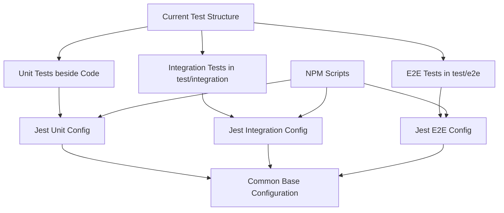

# Epic-Test - Task-11

# Restructuring the Test System for Backend and Infrastructure

**As a** software developer
**I want** a unified and well-structured test organization
**so that** tests are easier to understand, maintain, and extend

## Status

Complete

## Context

The current test structure in the project is inconsistent, which leads to difficulties in maintaining and extending the test system:

- Unit tests are partially located directly in the source code directory: `/src/backend/src/*/tests/`
- Integration tests are in a separate folder: `/src/backend/test/integration/`
- E2E tests are in: `/src/backend/test/app.e2e-spec.ts`
- Configuration is spread across multiple jest.config.js files

After analyzing Node.js Testing Best Practices (particularly following the approach by Yoni Goldberg), a comprehensive plan for restructuring the tests has been developed.

## Estimation

Story Points: 5

## Tasks

1. - [x] Unified Test File Placement
   1. - [x] Move unit tests next to the code being tested
   2. - [x] Standardize file naming with pattern `*.spec.ts`
   3. - [x] Migrate existing tests from `*/tests/` directories

2. - [x] Improve Integration Tests Structure
   1. - [x] Keep all integration tests in `/src/backend/test/integration/`
   2. - [x] Standardize file naming to `*.integration.spec.ts`
   3. - [x] Organize by domains (auth, users, etc.)

3. - [x] Optimize E2E Tests Structure
   1. - [x] Consolidate E2E tests in `/src/backend/test/e2e/`
   2. - [x] Organize by feature domains
   3. - [x] Enforce file naming convention `*.e2e-spec.ts`

4. - [x] Unify Jest Configuration
   1. - [x] Create root jest.config.js for common base
   2. - [x] Create specialized configurations for Unit/Integration/E2E tests
   3. - [x] Implement modular structure with inheritance

5. - [x] Adjust NPM Scripts
   1. - [x] Define scripts for individual test types
   2. - [x] Configure coverage reports
   3. - [x] Optimize watch mode for development

6. - [x] Additional Quality Improvements
   1. - [x] Introduce test factories for reusable test data
   2. - [x] Implement type-safe mocking
   3. - [x] Add security tags for relevant tests (OWASP)
   4. - [x] Improve exception handling in tests

## Constraints

- Existing tests must continue to function
- The CI/CD pipeline must not be interrupted
- Test coverage must not decrease
- All tests must still be able to run in a reasonable time

## Data Models / Schema

N/A - This story concerns the test structure, not the data models

## Structure

### Future Jest Configuration

```javascript
// Root jest.config.js for the common base configuration
module.exports = {
  preset: 'ts-jest',
  testEnvironment: 'node',
  moduleNameMapper: {
    '^src/(.*)$': '<rootDir>/src/$1',
    '^@app/(.*)$': '<rootDir>/../$1',
  },
  collectCoverageFrom: [
    'src/**/*.ts',
    '!src/**/*.spec.ts',
    '!src/**/*.mock.ts',
    '!src/**/index.ts'
  ]
};

// jest.unit.config.js
module.exports = {
  ...require('./jest.config'),
  testMatch: ['**/*.spec.ts'],
  testPathIgnorePatterns: [
    '/node_modules/',
    '/test/integration/',
    '/test/e2e/'
  ],
};

// jest.integration.config.js
module.exports = {
  ...require('./jest.config'),
  testMatch: ['**/test/integration/**/*.integration.spec.ts'],
  testTimeout: 60000,
};

// jest.e2e.config.js
module.exports = {
  ...require('./jest.config'),
  testMatch: ['**/test/e2e/**/*.e2e-spec.ts'],
  testTimeout: 90000,
};
```

### Future NPM Scripts

```json
{
  "scripts": {
    "test": "jest --config=jest.unit.config.js",
    "test:watch": "jest --config=jest.unit.config.js --watch",
    "test:integration": "jest --config=jest.integration.config.js",
    "test:e2e": "jest --config=jest.e2e.config.js",
    "test:all": "npm run test && npm run test:integration && npm run test:e2e",
    "test:coverage": "jest --config=jest.unit.config.js --coverage"
  }
}
```

## Diagrams



## Dev Notes

- Enforce AAA pattern (Arrange, Act, Assert) in all tests
- Test data should be realistic and meaningful
- Tests should be independent of each other and set up/tear down their own data
- Mocking should be used sparingly and only for external dependencies
- For integration tests, the naming pattern `*.integration.spec.ts` is mandatory

## Chat Command Log

- User: please review the test evaluation results. we should establish a uniform structure for unit and integration tests. currently, it's somewhat disorganized in @backend and @infrastructure. take another close look at @<https://github.com/goldbergyoni/nodejs-testing-best-practices> and then use sequential thinking to develop a plan for restructuring the test files. then present the plan to me.
- AI: [Presentation of a detailed test structuring plan]
- User: this plan sounds very good. for integration tests, always use the *.integration.spec.ts naming pattern. please also include point 7 ("Additional Improvements"). now create a task according to @workflows/workflow-agile-manual.mdc in the .ai folder
- User: please translate the task file to English!
