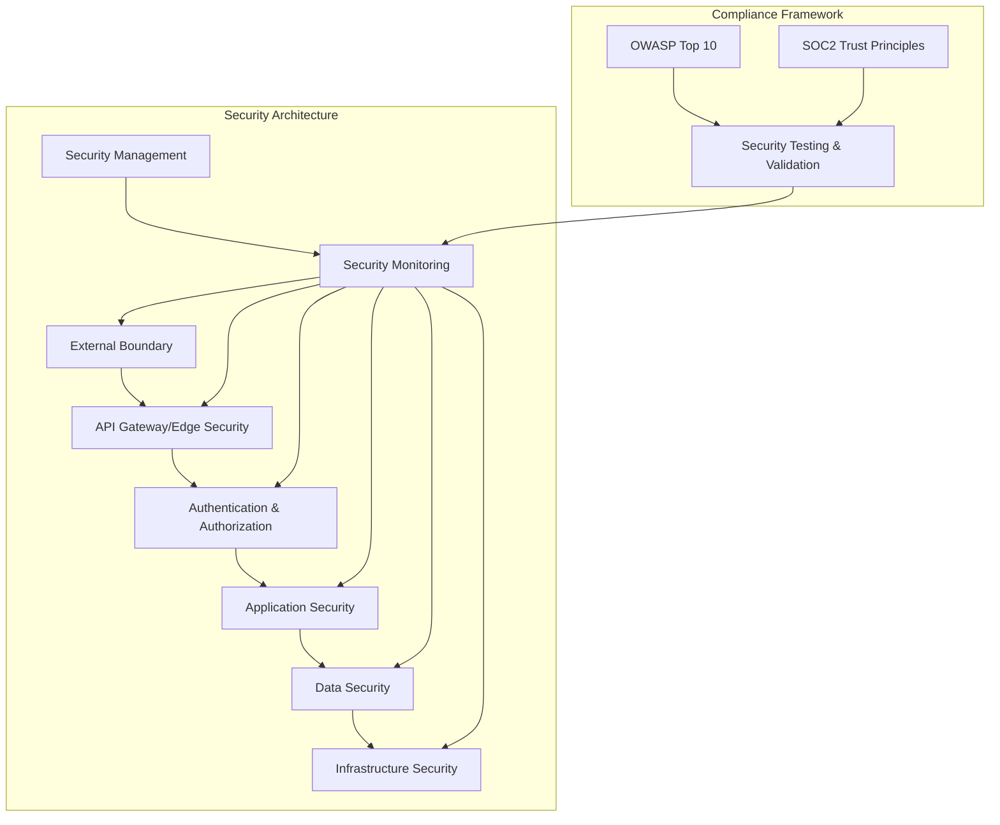

# Security Architecture

This document outlines the security architecture of the ACCI Nest Enterprise Application Framework, designed to meet both OWASP Top 10 and SOC2 compliance requirements.

## Security Architecture Overview

The security architecture follows a defense-in-depth approach with multiple layers of security controls:



## Security Layers

### 1. External Boundary Security

- **Network Protection**:
  - Web Application Firewall (WAF)
  - DDoS protection
  - IP filtering capabilities
  - Rate limiting

- **API Protection**:
  - API request validation
  - Request throttling
  - Bot protection
  
**OWASP/SOC2 Mapping**:

- OWASP A1: Broken Access Control
- OWASP A4: Insecure Design
- OWASP A10: Server-Side Request Forgery
- SOC2: Security, Availability

### 2. Authentication & Authorization

- **Authentication Framework**:
  - Multi-factor authentication
  - OAuth2/OpenID Connect support
  - SAML integration
  - Password policies with secure hashing
  - Account lockout mechanisms
  
- **Authorization System**:
  - Role-Based Access Control (RBAC)
  - Attribute-Based Access Control (ABAC)
  - Permission management
  - JWT with short expirations
  - Token revocation

**OWASP/SOC2 Mapping**:

- OWASP A1: Broken Access Control
- OWASP A2: Cryptographic Failures
- OWASP A7: Identification and Authentication Failures
- SOC2: Security, Confidentiality

### 3. Application Security

- **Input Validation**:
  - Request validation and sanitization
  - Content Security Policy (CSP)
  - XSS protection
  - CSRF protection
  
- **Secure Coding Practices**:
  - Parameterized queries
  - Output encoding
  - Error handling without information leakage
  - Third-party code review

**OWASP/SOC2 Mapping**:

- OWASP A3: Injection
- OWASP A5: Security Misconfiguration
- OWASP A9: Security Logging and Monitoring Failures
- SOC2: Security, Processing Integrity

### 4. Data Security

- **Data Encryption**:
  - Encryption at rest
  - Encryption in transit
  - Field-level encryption for sensitive data
  
- **Multi-Tenancy Isolation**:
  - Tenant data segregation
  - Cross-tenant access controls
  - Tenant-specific encryption keys
  
- **Secure Data Handling**:
  - Data classification
  - Data access controls
  - Privacy controls
  - Data retention policies

**OWASP/SOC2 Mapping**:

- OWASP A2: Cryptographic Failures
- OWASP A8: Software and Data Integrity Failures
- SOC2: Confidentiality, Privacy

### 5. Infrastructure Security

- **Secure Configuration**:
  - Hardened infrastructure
  - Principle of least privilege
  - Service isolation
  - Regular vulnerability scanning
  
- **Dependency Management**:
  - Regular dependency updates
  - Vulnerability scanning
  - Software Bill of Materials (SBOM)

**OWASP/SOC2 Mapping**:

- OWASP A5: Security Misconfiguration
- OWASP A6: Vulnerable and Outdated Components
- SOC2: Security, Availability

### 6. Security Monitoring & Logging

- **Comprehensive Logging**:
  - Security event logging
  - Authentication and authorization logs
  - Data access logs
  - Administrative action logs
  
- **Monitoring and Alerting**:
  - Real-time security monitoring
  - Anomaly detection
  - Alert management
  - Incident response

**OWASP/SOC2 Mapping**:

- OWASP A9: Security Logging and Monitoring Failures
- SOC2: Security, Availability

## Security Implementation Details

### Authentication Implementation

```typescript
// src/core/user-management/auth/auth.module.ts
@Module({
  imports: [
    PassportModule.register({ defaultStrategy: 'jwt' }),
    JwtModule.registerAsync({
      imports: [ConfigModule],
      useFactory: async (configService: ConfigService) => ({
        secret: configService.get('JWT_SECRET'),
        signOptions: {
          expiresIn: '15m', // Short-lived tokens for security
          issuer: 'acci-nest',
          audience: 'api',
        },
        verifyOptions: {
          ignoreExpiration: false,
          issuer: 'acci-nest',
          audience: 'api',
        },
      }),
      inject: [ConfigService],
    }),
    TypeOrmModule.forFeature([User, RefreshToken, LoginAttempt]),
    MfaModule,
  ],
  providers: [
    AuthService,
    JwtStrategy,
    PasswordService, // For secure password management
    RateLimitService, // For brute force protection
    AuditLogService, // For logging security events
  ],
  exports: [AuthService, JwtStrategy, PassportModule],
})
export class AuthModule {}
```

### Authorization Implementation

```typescript
// src/core/authorization/guards/permission.guard.ts
@Injectable()
export class PermissionGuard implements CanActivate {
  constructor(
    private reflector: Reflector,
    private permissionService: PermissionService,
    private tenantContextService: TenantContextService,
  ) {}

  async canActivate(context: ExecutionContext): Promise<boolean> {
    const requiredPermissions = this.reflector.getAllAndOverride<string[]>(
      PERMISSIONS_KEY,
      [context.getHandler(), context.getClass()],
    );

    if (!requiredPermissions || requiredPermissions.length === 0) {
      return true; // No permissions required
    }

    const request = context.switchToHttp().getRequest();
    const user = request.user;
    
    // Get current tenant context for tenant-aware permissions
    const tenantId = this.tenantContextService.getCurrentTenantId();
    
    // Log access attempt for audit trail (SOC2 compliance)
    await this.auditLogger.logAccessAttempt({
      userId: user.id,
      resource: request.path,
      action: request.method,
      permissions: requiredPermissions,
      tenantId,
    });

    // Check if user has ALL required permissions for the current tenant
    const hasAllPermissions = await this.permissionService.hasPermissions(
      user.id,
      requiredPermissions,
      tenantId,
    );

    // Log access decision for audit trail (SOC2 compliance)
    await this.auditLogger.logAccessDecision({
      userId: user.id,
      resource: request.path,
      action: request.method,
      allowed: hasAllPermissions,
      tenantId,
    });

    return hasAllPermissions;
  }
}
```

### Data Encryption Implementation

```typescript
// src/core/encryption/data.service.ts
@Injectable()
export class DataEncryptionService {
  constructor(
    private configService: ConfigService,
    private keyManagementService: KeyManagementService,
  ) {}

  /**
   * Encrypts sensitive data with AES-256-GCM
   * Implementation addresses OWASP A2:2021 (Cryptographic Failures)
   */
  async encrypt(
    data: string,
    context: EncryptionContext,
  ): Promise<EncryptedData> {
    // Get encryption key for the given context
    const key = await this.keyManagementService.getKey(context);
    
    // Generate random initialization vector
    const iv = crypto.randomBytes(16);
    
    // Create cipher using AES-256-GCM (NIST recommended)
    const cipher = crypto.createCipheriv('aes-256-gcm', key, iv);
    
    // Encrypt the data
    let encrypted = cipher.update(data, 'utf8', 'base64');
    encrypted += cipher.final('base64');
    
    // Get authentication tag for integrity verification
    const authTag = cipher.getAuthTag();
    
    // Return encrypted data with metadata for decryption
    return {
      data: encrypted,
      iv: iv.toString('base64'),
      tag: authTag.toString('base64'),
      version: this.configService.get('ENCRYPTION_VERSION'),
    };
  }

  /**
   * Decrypts data using AES-256-GCM
   * Implementation addresses OWASP A2:2021 (Cryptographic Failures)
   */
  async decrypt(
    encryptedData: EncryptedData,
    context: EncryptionContext,
  ): Promise<string> {
    const { data, iv, tag, version } = encryptedData;
    
    // Get decryption key for the given context and version
    const key = await this.keyManagementService.getKey(context, version);
    
    // Convert iv and tag from base64 to Buffer
    const ivBuffer = Buffer.from(iv, 'base64');
    const tagBuffer = Buffer.from(tag, 'base64');
    
    // Create decipher
    const decipher = crypto.createDecipheriv('aes-256-gcm', key, ivBuffer);
    
    // Set authentication tag for integrity verification
    decipher.setAuthTag(tagBuffer);
    
    // Decrypt the data
    let decrypted = decipher.update(data, 'base64', 'utf8');
    decrypted += decipher.final('utf8');
    
    return decrypted;
  }
}
```

### Security Logging Implementation

```typescript
// src/infrastructure/logging/security-logger.service.ts
@Injectable()
export class SecurityLoggerService {
  constructor(
    private logService: LogService,
    @Inject(SECURITY_CONFIG) private config: SecurityConfig,
  ) {}

  /**
   * Logs security events with proper context for SOC2 compliance
   * Addresses OWASP A9:2021 (Security Logging and Monitoring Failures)
   */
  async logSecurityEvent(event: SecurityEvent): Promise<void> {
    // Ensure all required fields are present
    this.validateSecurityEvent(event);
    
    // Add timestamp if not provided
    if (!event.timestamp) {
      event.timestamp = new Date();
    }
    
    // Structure log for centralized security monitoring
    const structuredLog = {
      type: 'SECURITY_EVENT',
      severity: event.severity || 'INFO',
      category: event.category,
      action: event.action,
      status: event.status,
      userId: event.userId,
      tenantId: event.tenantId,
      resourceId: event.resourceId,
      resourceType: event.resourceType,
      ipAddress: event.ipAddress,
      userAgent: event.userAgent,
      timestamp: event.timestamp,
      details: event.details,
      correlationId: event.correlationId,
    };
    
    // Log at appropriate level based on severity
    switch (event.severity) {
      case 'CRITICAL':
      case 'ERROR':
        await this.logService.error(structuredLog);
        break;
      case 'WARNING':
        await this.logService.warn(structuredLog);
        break;
      case 'INFO':
      default:
        await this.logService.info(structuredLog);
    }
    
    // For critical events, trigger real-time alerts
    if (event.severity === 'CRITICAL' && this.config.enableRealTimeAlerts) {
      await this.triggerSecurityAlert(structuredLog);
    }
  }
  
  // Additional methods for specific security events...
}
```

## Security Testing Strategy

Security testing is integrated throughout the development lifecycle to ensure OWASP Top 10 and SOC2 compliance:

1. **Static Application Security Testing (SAST)**:
   - Automated code scanning for security vulnerabilities
   - Integration with CI/CD pipeline
   - Regular manual code reviews with security focus

2. **Dynamic Application Security Testing (DAST)**:
   - Automated scanning of running application
   - Regular penetration testing
   - API security testing

3. **Dependency Scanning**:
   - Regular scanning of dependencies for vulnerabilities
   - Automated updates for security patches
   - Software composition analysis

4. **Security Unit Testing**:
   - Security-focused unit tests
   - Testing of security controls
   - Validation of encryption implementations

5. **Compliance Validation**:
   - Mapping of security controls to OWASP Top 10
   - Mapping of security controls to SOC2 trust principles
   - Regular compliance assessments

## Security Documentation

Comprehensive security documentation is maintained to support OWASP Top 10 and SOC2 compliance:

- **Security Policies**: Documented security policies and procedures
- **Security Controls**: Documentation of security control implementations
- **Security Architecture**: Detailed security architecture documentation
- **Threat Model**: Documented threat model and risk assessment
- **Compliance Mapping**: Mapping of security controls to compliance requirements
- **Audit Evidence**: Documentation of security tests and assessments

## Security Governance

Security governance ensures ongoing compliance with OWASP Top 10 and SOC2 requirements:

- **Security Reviews**: Regular security reviews of the architecture
- **Risk Assessments**: Regular security risk assessments
- **Compliance Monitoring**: Continuous monitoring of compliance status
- **Security Metrics**: Tracking of security metrics and KPIs
- **Incident Response**: Documented incident response procedures
- **Security Training**: Security awareness training for developers
