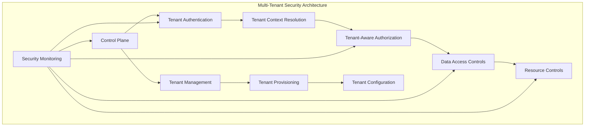

# Multi-Tenant Security Architecture

This document outlines the security architecture and implementation guidelines for the multi-tenant aspects of the ACCI Nest Enterprise Application Framework. It addresses both OWASP Top 10 and SOC2 compliance mapping, and implementation guidelines for secure multi-tenancy.

## Table of Contents

- [Overview](#overview)
- [Security Principles](#security-principles)
- [Tenant Isolation Implementation](#tenant-isolation-implementation)
- [Control Plane Security](#control-plane-security)
- [Performance Isolation](#performance-isolation)
- [OWASP Top 10 Compliance](#owasp-top-10-compliance)
- [SOC2 Compliance](#soc2-compliance)
- [Security Testing Strategy](#security-testing-strategy)
- [References](#references)

## Overview

Multi-tenancy introduces specific security challenges that must be addressed to ensure proper data isolation, resource fairness, and secure tenant management. This document outlines our approach to securing the multi-tenant aspects of the application.



## Security Principles

The following key principles guide our multi-tenant security implementation:

1. **Complete Tenant Isolation** - Tenants must be completely isolated from one another without possibility of cross-tenant data access
2. **Defense in Depth** - Multiple security layers must enforce tenant boundaries
3. **Least Privilege** - All components operate with minimal permissions needed for functionality
4. **Secure by Default** - Default configurations must enforce tenant isolation
5. **Auditable Operations** - All cross-tenant operations must be explicitly logged for audit trails
6. **Fair Resource Allocation** - Resource controls must prevent denial of service to other tenants
7. **Tenant Context Integrity** - Tenant context must be maintained throughout the request lifecycle

## Tenant Isolation Implementation

### Data Isolation

Data isolation is implemented through:

1. **Row-Level Tenant Filtering** - All database queries include tenant ID filtering
2. **TenantAwareRepository Pattern** - Repository base class that enforces tenant filtering
3. **Tenant ID in Primary Keys** - Composite keys include tenant ID for added isolation
4. **Schema-Level Isolation** (for premium tenants) - Separate database schemas per tenant

Example implementation:

```typescript
// src/core/multi-tenancy/repositories/tenant-aware.repository.ts
export abstract class TenantAwareRepository<T extends BaseEntity> {
  constructor(
    @InjectRepository(EntityClass) protected repository: Repository<T>,
    @Inject(TENANT_CONTEXT) protected tenantContext: TenantContext,
  ) {}
  
  async findAll(options?: FindManyOptions<T>): Promise<T[]> {
    const tenantId = this.tenantContext.getCurrentTenant();
    
    // Apply tenant filter to all queries
    return this.repository.find({
      ...options,
      where: {
        ...(options?.where || {}),
        tenantId,
      },
    });
  }
  
  // Additional methods...
}
```

### Authorization Boundaries

Tenant boundaries are enforced through:

1. **Tenant-Aware Authorization Guards** - Check tenant membership for resource access
2. **Cross-Tenant Access Policies** - Explicit policies for authorized cross-tenant scenarios
3. **Object-Level Security** - All domain entities include tenant checks

Example implementation:

```typescript
// src/core/multi-tenancy/guards/tenant-resource.guard.ts
@Injectable()
export class TenantResourceGuard implements CanActivate {
  constructor(
    private tenantContext: TenantContextService,
    private tenantAccessPolicy: TenantAccessPolicyService,
  ) {}

  async canActivate(context: ExecutionContext): Promise<boolean> {
    const request = context.switchToHttp().getRequest();
    const user = request.user;
    const resourceTenantId = request.params.tenantId || request.body.tenantId;
    const currentTenantId = this.tenantContext.getCurrentTenantId();
    
    // Simple same-tenant check
    if (resourceTenantId === currentTenantId) {
      return true;
    }
    
    // Cross-tenant access requires explicit policy check
    return this.tenantAccessPolicy.canAccessTenant(
      user.id, 
      currentTenantId, 
      resourceTenantId
    );
  }
}
```

## Control Plane Security

The Control Plane manages tenant lifecycle and requires strong security controls:

### Tenant Management Security

1. **Admin-Only Access** - Control Plane operations restricted to admin roles
2. **Privileged Operation Logging** - All tenant management operations are logged
3. **Two-Factor Authentication** - Required for sensitive tenant operations
4. **Tenant Creation Approval Workflow** - Multi-step approval for new tenants
5. **Secure Configuration Storage** - Tenant configurations securely stored

Example implementation:

```typescript
// src/core/multi-tenancy/control-plane/tenant-management.service.ts
@Injectable()
export class TenantManagementService {
  constructor(
    @InjectRepository(Tenant) private tenantRepository: Repository<Tenant>,
    private securityAuditService: SecurityAuditService,
    private encryptionService: EncryptionService,
  ) {}

  @RequiresRole('TENANT_ADMIN')
  @Requires2FA
  @AuditLog('TENANT_CREATION')
  async createTenant(createTenantDto: CreateTenantDto, adminUser: User): Promise<Tenant> {
    // Log the tenant creation attempt
    await this.securityAuditService.logTenantOperation({
      operation: 'CREATE_TENANT',
      performedBy: adminUser.id,
      details: { tenantName: createTenantDto.name }
    });
    
    const tenant = new Tenant();
    tenant.name = createTenantDto.name;
    tenant.status = TenantStatus.INITIALIZING;
    
    // Encrypt sensitive tenant configuration
    if (createTenantDto.config) {
      tenant.encryptedConfig = await this.encryptionService.encrypt(
        JSON.stringify(createTenantDto.config),
        { context: 'tenant-config', id: uuid() }
      );
    }
    
    // Save and return tenant
    return this.tenantRepository.save(tenant);
  }
  
  // Additional methods...
}
```

## Performance Isolation

Preventing "noisy neighbor" problems through:

1. **Tenant-Specific Rate Limiting** - Configurable API request limits per tenant
2. **Resource Quotas** - Enforced limits on resource consumption
3. **Fair Scheduling** - Background job scheduling with tenant fairness
4. **Connection Pool Management** - Tenant-specific database connection pools
5. **Usage Monitoring and Alerting** - Detect and respond to abnormal usage patterns

Example implementation:

```typescript
// src/core/multi-tenancy/middleware/tenant-rate-limiter.middleware.ts
@Injectable()
export class TenantRateLimiterMiddleware implements NestMiddleware {
  constructor(
    private tenantConfigService: TenantConfigService,
    private rateLimiterService: RateLimiterService,
    private securityAlertService: SecurityAlertService,
  ) {}

  async use(req: Request, res: Response, next: NextFunction) {
    const tenantId = req.headers['x-tenant-id'] as string;
    
    // Get tenant-specific limits
    const tenantLimits = await this.tenantConfigService.getTenantLimits(tenantId);
    
    // Apply rate limiting
    const rateLimitResult = await this.rateLimiterService.checkLimit({
      key: tenantId,
      pointsToConsume: 1,
      maxPoints: tenantLimits.requestsPerMinute,
      duration: 60,
    });
    
    if (rateLimitResult.rejected) {
      // Security alert for potential abuse
      if (rateLimitResult.consumedPoints > tenantLimits.alertThreshold) {
        await this.securityAlertService.createAlert({
          alertType: 'RATE_LIMIT_EXCEEDED',
          severity: 'WARNING',
          tenantId,
          details: {
            consumedPoints: rateLimitResult.consumedPoints,
            threshold: tenantLimits.requestsPerMinute,
          }
        });
      }
      
      res.status(429).json({ message: 'Rate limit exceeded' });
      return;
    }
    
    next();
  }
}
```

## OWASP Top 10 Compliance

### A1:2021 - Broken Access Control

Multi-tenancy implementation addresses access control through:

- Tenant context enforcement in all data access operations
- Tenant-aware authorization guards
- Proper tenant context resolution from authentication

### A3:2021 - Injection

Prevents injection attacks in multi-tenant context:

- Parameterized queries with tenant ID
- Input validation checking tenant boundaries
- ORM usage with tenant filtering

### A4:2021 - Insecure Design

Multi-tenant architecture follows secure design principles:

- Tenant isolation by design
- Defense in depth approach
- Control Plane security by design

### A5:2021 - Security Misconfiguration

Prevents tenant isolation bypass through misconfiguration:

- Secure tenant onboarding process
- Tenant configuration validation
- Tenant-specific security settings

### A7:2021 - Identification and Authentication Failures

Strong tenant authentication:

- Tenant context validation
- Tenant-specific identity providers
- Cross-tenant access controls

### A9:2021 - Security Logging and Monitoring Failures

Multi-tenant monitoring and logging:

- Tenant context in all security logs
- Tenant-specific security alerts
- Cross-tenant access audit logging

## SOC2 Compliance

### Security

- Tenant data isolation controls
- Tenant access management
- Control Plane security

### Availability

- Tenant-specific performance monitoring
- Fair resource allocation
- Tenant-aware scaling

### Processing Integrity

- Tenant context validation
- Cross-tenant operation integrity
- Tenant data validation

### Confidentiality

- Tenant data segregation
- Cross-tenant access controls
- Tenant-specific encryption keys

### Privacy

- Tenant-specific privacy settings
- Tenant data isolation
- Cross-tenant privacy controls

## Security Testing Strategy

Security testing specific to multi-tenancy includes:

1. **Tenant Isolation Testing**
   - Attempted cross-tenant data access
   - Tenant context manipulation tests
   - Tenant boundary verification

2. **Performance Isolation Testing**
   - Load testing with tenant context
   - Resource limit enforcement testing
   - Rate limiting verification

3. **Control Plane Security Testing**
   - Tenant management authorization tests
   - Tenant configuration security tests
   - Tenant provisioning security validation

4. **Multi-Tenant Penetration Testing**
   - Simulated attacks across tenant boundaries
   - Control Plane attack scenarios
   - Tenant context manipulation attempts

## References

- [OWASP Multi-Tenant Security Guidelines](https://owasp.org/www-pdf-archive/Securing-multi-tenant-applications.pdf)
- [SOC2 Multi-Tenant Considerations](https://www.aicpa.org/content/dam/aicpa/interestareas/frc/assuranceadvisoryservices/downloadabledocuments/trust-services-criteria.pdf)
- Internal Architecture Documentation
  - [Architecture Overview](../security/architecture.md)
  - [OWASP Compliance Mapping](../security/owasp-mapping.md)
  - [SOC2 Compliance Mapping](../security/soc2-mapping.md)
